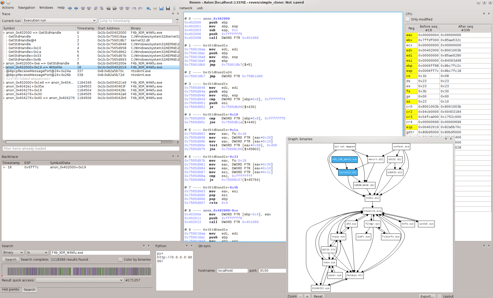
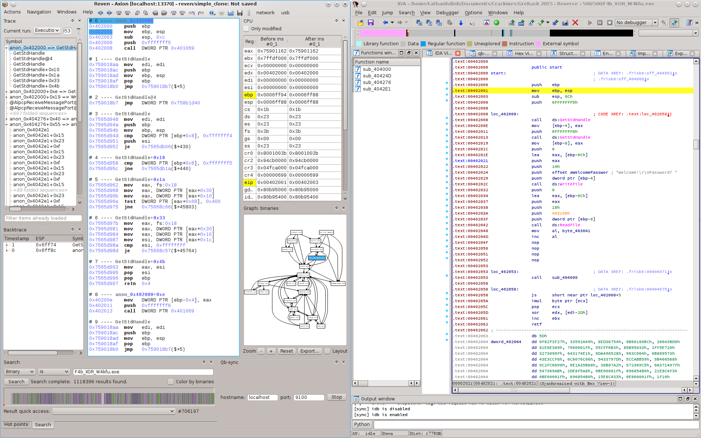
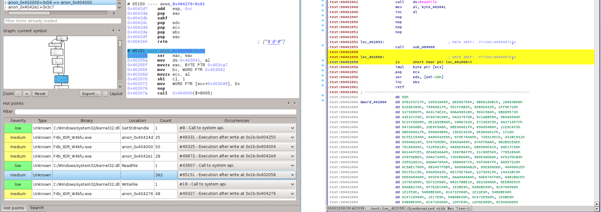
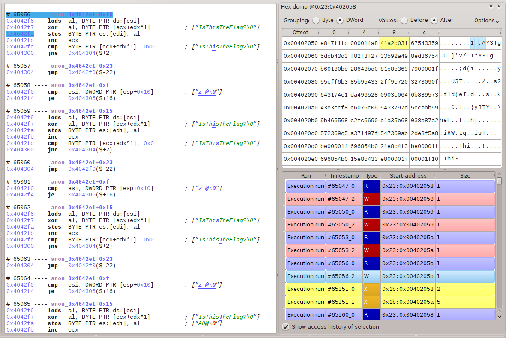
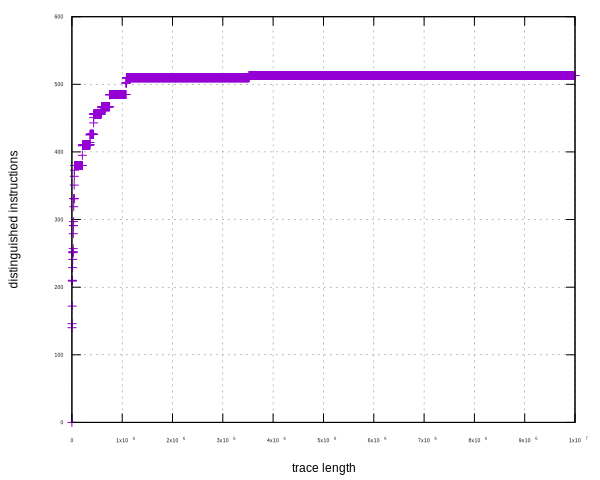
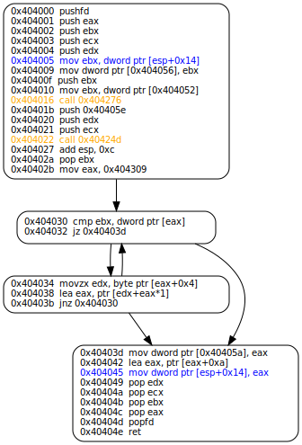
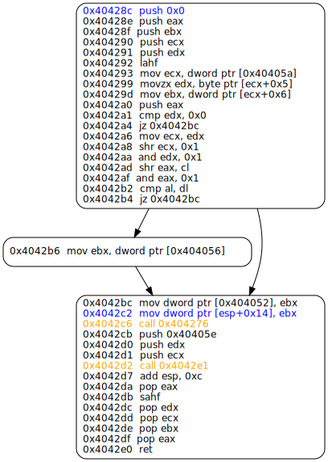
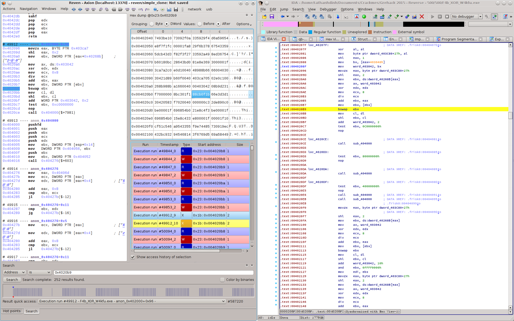
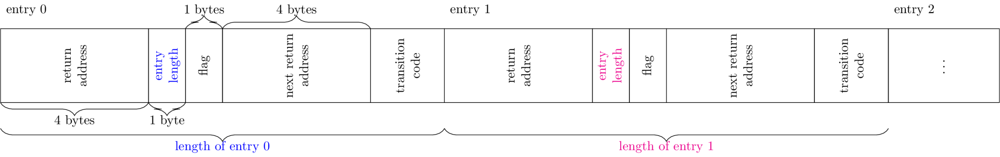

# Reversing an _onion_ obfuscated challenge with REVEN

  We present a code reverse engineering task with our product Reven. The binary examined here is `F4b_XOR_W4kfu`, it is also the challenge of the highest point over all categories (cryptography, exploit, reverse engineering, etc) in the [Grehack 2015's CTF](https://grehack.fr/2015/ctf). The binary is heavily obfuscated, but the obfuscation techniques implemented are novel and interesting.

  This is the first article of a series where we introduce our ongoing work in developing an *automated code deobfuscation* system using the *symbolic execution* framework of REVEN. Since our approach is **operational** (i.e. we require some information about how the obfuscation techniques are implemented) this article presents technical details that we discovered in reversing `F4b_XOR_W4kfu`. 
  
  It is also quite verbose, and we apologize for this annoying. We try our best to explicate not only "how" the challenge works without skipping any detail, but also sometimes "why". We believe that such a question is more important.

  **Remark:**
  *To the our best knowledge, most approaches in binary code deobfuscation are operational, fully denotational approaches work in very strict cases only. As a direct consequence of [Rice's theorem](https://en.wikipedia.org/wiki/Rice%27stheorem), learning general programs simply from input/output relation is a well-known undecidable problem. Even for much more restricted contexts, static analysis is [proven to be NP-hard](http://citeseerx.ist.psu.edu/viewdoc/summary?doi=10.1.1.35.2337) for [smartly](https://www.cs.ucsb.edu/~chris/research/doc/acsac07limits.pdf) [obfuscated](http://llvm.org/pubs/2008-02-ImpedingMalwareAnalysis.pdf) programs. Recent [semantics-based](https://www.cs.arizona.edu/people/debray/Publications/ccs-unvirtualize.pdf) approaches are intrinsically [operational](http://static.usenix.org/event/woot09/tech/full_papers/rolles.pdf); though [some](https://cs.arizona.edu/~debray/Publications/ccs2015-symbolic.pdf) are considered [generic](https://www.cs.arizona.edu/people/debray/Publications/generic-deobf.pdf), they work only on simple cases of very specific obfuscation techniques. However, special classes of loop-free programs can be efficiently [synthesized](http://people.eecs.berkeley.edu/~sseshia/pubdir/synth-icse10.pdf) from input/output with helps of SMT solvers.*

## Reven - a very short introduction

  Basically, REVEN Axion is a **system-level symbolic execution** engine,  enriched by code analysis plugins interacting with the core using Python or C/C++ API. One of the essential differences between Reven and other engines is that it does symbolic execution for *all execution threads* presenting on the system, from ring 0 to ring 3.

  In a basic reversing engineering task with Reven, we start by creating a **scenario** which executes the considered binary in a virtual machine; the result of the scenario will be used in further analysis. For example, in case of `F4b_XOR_W4kfu` we create a scenario which executes the binary with some input flag, the scenario terminates when the binary stops.

  

  An advantage of Reven is that it **computes** all instructions being executed instead of running them on real hardware, it is then virtually immune (a.k.a until someone finds out bugs :-)) from anti-debugging/instrumenting tricks that might be applied. Symbolically executed instructions come from all threads on the system since a *scenario is system-wide*; but we can always filter instructions executed by the examined binary, the result is somehow equivalent with the execution trace.

  **Remark:**
  *The approach of Reven is different from debuggers and [dynamic](http://www.dynamorio.org/) [binary](https://software.intel.com/en-us/articles/pin-a-dynamic-binary-instrumentation-tool) [instrumentation](http://valgrind.org/) [tools](http://www.frida.re/) where instructions are still executed on the real hardware, that is still a rich source for [escaping tricks](https://recon.cx/2012/schedule/attachments/42FalconRiva2012.pdf) which exploit [nontransparent effects](https://www.blackhat.com/docs/us-14/materials/us-14-Li-Defeating-The-Transparency-Feature-Of-DBI.pdf) of DBI. Yet, Reven has to pay for this "more transparent" approach, it is slower than DBI tools and debuggers.*

  **Synchronization with IDA Pro:** Reven is rather a dynamic analysis tool, it has not yet advanced static analysis features (static disassembly/decompilation, control-flow analysis, etc) that we may normally observe [in](https://binary.ninja/) [other](https://www.hopperapp.com/) [tools](https://www.hex-rays.com/products/ida/). Currently, we can **synchronize** between Reven and IDA Pro (as a "de-facto" reverse code engineering tool) using [qb-sync](https://github.com/quarkslab/qb-sync) to combine the strength of both.

  That is enough for self-promoting words :), it's time to take our hand dirty.

## Introduction

  `F4b_XOR_W4kfu.exe` is a 32 bits PE binary, without any fancy GUI, it asks for a password from the standard input and then prints `Nop!` or `Yes!`. The mission is to find out the good password (one that makes the program print `Yes!`).

    ./F4b_XOR_W4kfu.exe
    Welcome!
    Password? 1234aqzert
    Nop!⏎

  The program uses several **obfuscation** techniques to prevent itself from being analyzed. *First*, its execution traces are extremely long taking consideration that the program is *just* a CTF challenge. To get some idea about how long these traces are, after receiving the input, there are 2.716.465.511 instructions executed until the first comparison of the password checking procedure. This is because of a [code decryption/re-encryption](https://www.cosic.esat.kuleuven.be/wissec2006/papers/3.pdf) mechanism and of a [nested multiprocess virtual machine](https://aspire-fp7.eu/spro/wp-content/uploads/SPRO2015_Workshop_Talk_V2.pdf) execution model.

  *Second*, the "input related" instructions are not local, they spread out the long trace, and hard to be [sliced](http://www.cs.columbia.edu/~junfeng/08fa-e6998/sched/readings/slicing.pdf). That makes difficult to figure out how the input password is manipulated and checked. Moreover the password checking algorithm is "mostly" constant time.

  *Last but not least*, most instructions of the binary are encrypted, they are decrypted just before executing and are immediately encrypted later, so we cannot [unpack](https://www.cs.arizona.edu/people/debray/Publications/static-unpacking.pdf) it in the [classical sense](http://ftp.cs.wisc.edu/paradyn/papers/Roundy12Packers.pdf). The code [formal approximation](https://en.wikipedia.org/wiki/Abstract_interpretation) using [phase semantics](https://www.cs.arizona.edu/people/debray/Publications/metamorphic.pdf) should work but its result is also trivial: the fixed point is too coarse to analyze on. More practical approaches based on code [phases](https://www.semanticscholar.org/paper/Reverse-Engineering-Self-Modifying-Code-Unpacker-Debray-Patel/01e90e360114da419a98591c2b58ec54154d6a0b/pdf) or [waves](https://hal.inria.fr/hal-01257908/file/codisasm.pdf) cannot apply since they require that the code must be "stable" at some execution point. Recently, some authors classify such technique of code packing into [type VI](http://s3.eurecom.fr/docs/oakland15_packing.pdf), the most sophisticated class of binary code packers.

  These properties make difficult for direct dynamic/concolic/static analysis, this binary is also a fine counterexample which invalidates hypothesis in current automated code deobfuscation methods. Low-hanging fruit approaches, e.g. black-box attack on counting number of executed instructions, seems not feasible: there is volume of more than 2.7 billion instructions must be passed before reaching the first "input sensitive" comparison.

## Workaround

  The binary has 4 sections, all are marked as executable, writable and executable. The section `.frisk0` seems only an ID of all GreHack's binaries, so we are not surprise. The execution starts from `0x402000` which is also the entry point, no TLS callback trick is applied, as confirmed by both Reven and IDA.

  Several first instructions seem benign, for example, ones at `0x402008` and `0x402013` are calls to `GetStdHandle` The program calls `WriteFile` at `0x40202c`, and `ReadFile` at `0x402042`. It prints the strings `Welcome!` and `Password?`, then reads from the standard input.

  

  But this short easy reversing time has finished, from now, easy codes do not exist anymore >:)

### Code overwriting

  Passing statically over simple instructions above, the next instructions seem "normal", some `nop`(s), then a `call 0x40400`. However, Reven notices that there are lots of **execution after write** (i.e. some memory addresses are overwritten before getting executed). Some of them are redundant alerts since the process mapping mechanism of `ntoskrnl.exe`, but the first one which really attracts our attention is at `0x402058`: the really executed instruction is `xor eax, eax`, instead of `js 0x40200d` from the static disassembling result.

  

  **Remark:**
  *Different form DBI tools and debuggers which work at process level, Reven works at system level, it can trace the [flow of creating a process](https://download.microsoft.com/download/1/4/0/14045A9E-C978-47D1-954B-92B9FD877995/97807356648739_SampleChapters.pdf) (i.e. before the program gets run), here many instructions of the binary are mapped (i.e. written) into the memory using some functions (e.g. `MiCopyOnWrite`) inside `ntoskrnl.exe`, then executed when the program gets run. Consequently, these instructions are redundantly marked as "execution after write".*

  There must be something following `call 0x40400` has modified the instruction at `0x402058`. By backward [dynamic tainting analysis](http://bitblaze.cs.berkeley.edu/papers/taintcheck-full.pdf), Reven shows a chain of `read/write/execute` on this address, the nearest instruction which writes on the address is at `0x4042fa`, that is `stosb`.

  
  
### Global control flow graph

  We now know that the binary will modify some instructions before executing them, this can be revealed by examining the instructions following `call 0x40400`; but to get quickly an intuition about what is going on, we extract a partial *control flow graph* from the trace of Reven. The following graph is constructed from a trace of 10.000.000 instructions starting from `0x402048`.

  
  (this is a vector image, click on it to observe the details)

  **Remark:**
  *The control flow graph given by Reven is partial since it is constructed using the dynamic trace computed from running program with a concrete input, but it gives at least some information about which kind of code that we deal with.*

### Code virtualization

  The form of control flow graph suggests that it may be a **virtual machine** with [switch-based dispatcher](http://static.usenix.org/event/woot09/tech/full_papers/rolles.pdf). The typical form of such a VM consists of a *dispatcher* spreads over several basic blocks; and there exist many *opcode handlers*, each located in a "non trivial" basic block to which control flow is transferred from a much smaller number of "dispatch points".

  The basic blocks for opcode handlers are possibly, for example, ones start with the instruction at `0x402513`, `0x40206a`, `0x4025d`, etc; the control flow transferred to all of them comes from the basic block ends with `0x4042e0`, which may be the *dispatch point* of the dispatcher. Moreover, these basic blocks transfer the control flow to the same basic block start with the address `0x404000` (since they both end with `call 0x404000`), which may be the *entry point* of the dispatcher.

  **Remark:**
  *There are basic blocks, for example, at `0x4043a4`, `0x404371`, `0x40428c`, etc. which come from (and reach to) the same address; but they might not opcode handlers since their semantics is trivial: most of them consists of just a simple unconditional direct `jmp 0x40428`.*

#### Distinguished instruction rate

  Another criterion supporting the intuition about VM obfuscation, is *the number of distinguished instructions over the total number of executed instructions*. Since the number of "virtual instructions" is normally much smaller than the number of the real hardware instructions (i.e.`x86` ISA), we would observe that there are not "too much" distinguished instructions in a binary obfuscated by a VM. The following diagram presents the number of distinguished instructions over the trace length: there are only about 500 distinguished instructions over a trace of length 10.000.000!!!

  

  **Remark:**
  *Such a form of control flow graph can be observed also in binaries obfuscated by [VMProtect](http://vmpsoft.com/) and some early versions of [Code Virtualizer](http://oreans.com/codevirtualizer.php). In recent versions, Code Virtualizer uses [threaded code](http://home.claranet.nl/users/mhx/ForthBell.pdf): the control flow to the next opcode's handler will be calculated at the end of the current handler, then we cannot observe this form. In some ad-hoc VM obfuscated binaries, e.g. [HyperUnpackMe2](http://crackmes.de/users/thehyper/hyperunpackme2/), the dispatcher has multiple dispatch points (there was a very nice [writeup](http://www.openrce.org/articles/full_view/28) of this binary using IDA). The replacement of the switch by nested if commands gives a similar effect.*
  
  *The patterns above then just give a hint to recognize the applied obfuscation technique. Without a serious analysis, we cannot say that the binary is obfuscated by a VM. Indeed, the same patterns can be observed in programs which are not obfuscated at all, and conversely some program are VM obfuscated but these pattern are not [directly visible](http://www.lancaster.ac.uk/staff/wangz3/publications/trustcom.pdf). Finally, we do not give a formal definition for virtualization obfuscation yet :-). We will come back to this problem in next articles.*

## Reversing the first virtual machine

  So we have an intuition that there exists possibly a VM whose entry point of the dispatcher starts with `0x404000`, and single dispatch point ends at `0x4042e0`. We reverse now the dispatcher to understand in details how it works.

### First phase

  The dispatcher can be divided into "two phases" with "transition instructions" between: the second phase strictly [postdominances](https://en.wikipedia.org/wiki/Dominator_(graph_theory)) the transition code, whereas the transition strictly postdominances the first phase. This comes with the following control flow graph.

  

#### Return address table

  As can be seen previously in the global CFG, the `ret` instruction at `0x40404e` will transfer the control flow to different basic blocks, but the continued instructions are not the ones following `call 0x404000`. The called function is then not a "standard" function which we normally observe in an [Algol-like language](http://c2.com/cgi/wiki?AlgolFamily): it does not return to the location following where it is called. The [return address](https://en.wikipedia.org/wiki/Return-oriented_programming) must be modified somewhere.

  **Return address modification:** 
  looking into instructions at `0x404005` and `0x404009`, we observe that the original return address is saved to the memory at `0x404056`, then the return address is overwritten by the instruction `mov [esp + 0x14], eax` at `0x404045`. This new address is computed from a loop between `0x404030` and `0x40403b`.

  The semantics of the loop is simple: it consumes `ebx` which is the current return address (c.f. `pop` at `0x40402a` as well as `push` at `0x40400f`), and a list at address `0x404309`. It  looks for an entry in the list so that its `return address` is equal to the current return address. When the entry is found, the new return address is updated by the `transition code` of the entry. The structure of this table is shown below.

  

  Entries in this table are consecutive: *the location of the next entry is calculated by adding the current entry with its length*. So once we know the starting address, which is `0x404309`, all entries can be completely located. The following algorithm calculates the new return address `nextRet` from the current one `currentRet`.

    let retTable be the array of bytes from 0x404309
    let mutable entryOffset = 0
    while currentRet <> dword [retTable + entryOffset] do // look for the corresponding entry
      let entryLength = retTable[entryOffset + 4]
      entryOffset <- entryOffset + entryLength
    nextRet = dword [retTable + entryOffset + 10]

#### Address interval computation and encryption

  We now notice to call instructions at `0x404016` and `0x404022`, the called functions are standard (i.e. they return back to the location following where they are called). These functions are strongly correlated, their semantics is simple but important.

  **Address interval computation:** 
  the first function consumes a `dword` at `0x404052` (through `ebx`), a table of `dword`(s) at `0x40406d`; and return the first pair of two consecutive `dword`(s) of this table (through `ecx` and `edx`) satisfying `ecx <= ebx <= edx`. The algorithm of this function is shown below.

    let inTable be the array of dword(s) from 0x404052 to 0x40424d
    let inEbx = dword [0x404052]
    let loBounds, hiBounds = List.foldBack (fun addr (los, his) -> addr::his, los) inTable ([], [])
    (outEcx, outEdx) = List.find (fun (lo, hi) -> (lo <= inEbx && inEbx <= hi)) <| List.zip loBounds hiBounds

  **Code interval encryption:** the second consumes the output of the first one as an interval of addresses and the string `IsThisTheFlag?` (no, we have tried, and it is not the flag :P), it simply `xor` this interval with this string under [ECB mode](https://en.wikipedia.org/wiki/Block_cipher_mode_of_operation).

#### Summary

  By statically reversing instructions of the first phase, not everything is clear until now, but we have obtained some information. Concretely, the first phase has:
  
    * backed up the original return address as a `dword` at `0x404056`,
    * calculated an interval of addresses using a `dword` stored at `0x404052`, then
    * `xor`ed the interval with the string `IsThisTheFlag?`,
    * used the original return address to find an entry in the return address table, next 
    * calculated the address of `transition code` of this entry, and
    * used this address to replace the original return address at the stack, then
    * backed up the address of the entry as a `dword` at `0x40405a`, finally
    * used `ret` to transfer the control flow to the `transition code`.
  
  At this point, we cannot yet "prove" the meaning of the address interval, neither the `dword` stored at `0x404052` (we will do this later). But honestly, using the global control flow graph, and dynamically checking on Reven how these addresses are used, we **already know** that each interval is possibly the bound of an opcode handler, the `dword` at `0x404052` stores nothing but the entry point of the last executed handler. This might be tricky :P, but Reven is really helpful in suggesting what happened.

### Transition code

  Because of the effect of `ret`, the control flow is transferred to transition instructions located at the `transition code`. The addresses of transition code can be extracted easily using the structure of the return address table introduced above.

    0x404313; 0x404322; 0x404331; 0x404344; 0x404353; 0x404362; 0x404371; 0x404380; 0x40438f; 0x4043a4; 
    0x4043b3; 0x4043c2; 0x4043d1; 0x4043e3; 0x4043f2; 0x404401; 0x404410; 0x40441f; 0x40442e; 0x40443d; 
    0x40444f; 0x40445e; 0x40446d; 0x40447c; 0x40448b; 0x40449a; 0x4044a9; 0x4044b8; 0x4044c7; 0x4044d6; 
    0x4044eb; 0x4044fa; 0x404509; 0x404518; 0x404527; 0x404536; 0x404545; 0x404554; 0x404563; 0x404579; 
    0x404588; 0x404597; 0x4045a6; 0x4045b5; 0x4045c4; 0x4045d6; 0x4045e5; 0x4045f4; 0x404603; 0x404612; 
    0x404621; 0x404630; 0x40463f; 0x40464e; 0x40465d; 0x40466c; 0x40467b; 0x40468a; 0x404699; 0x4046a8

  We can also check these addresses on the global control flow graph above, all of them terminates by an unconditional direct `jmp 0x40428c` which transfers the control flow to the second phase of the dispatcher.

### Second phase

  The second phase of the dispatcher starts from the address `0x40428c` and terminates at `0x4042e0` (we know that since this is also the address of the single dispatch point that we have observed from the global control flow graph). This phase has the following control flow graph.
  
  
 
#### Return address modification

  The second phase uses some similar tricks as the first one. The last instruction `ret` diverts also the control flow to different addresses, this is the effect of the instruction at `0x404208c` (which reverses a space for the return address), and one at `0x4042c2` (which fills the return address). From the global control flow graph, each return address commences an opcode handler.
  
#### Inter-phase encryption/decryption relation

  There are also two calls, one at `0x4042c6` which calls the same function as  `0x404016` in the first phase, another at `0x4042d2` which calls a different function but *exactly the same* as one at `0x404022` (also in the first phase). 
  
  **Remark:**
  *We still do not understand yet why the functions called at `0x404022` (in the first phase) and `0x4042d2` (in the second) are exactly the same; this is obviously a code redundant. :-/*

  We recall that the functions in the first phase consume first a `dword` stored at `0x404052` to calculate an address interval, then `xor` this interval with `IsThisTheFlag?`. The functions in the second phase do exactly the same thing, except that they consume a `dword` either stored at `0x404056` (c.f. the instruction at `0x4042b6`) or extracted from `ecx+0x6` (c.f. the instruction at `0x40429d`).
  
  The `dword` consumed in the first phase comes from `0x404052`. Initially, when analyzing the first phase, we do not understand where the value at `0x404052` comes from; but now in the second phase we know that `0x404052` is used to store the value consumed by the two functions (c.f. the instruction at `0x4042bc`).
      
  **Code gadget encryption/decryption:**
  so the pair of functions called in each phase consumes *the same value* to calculate an interval of address, then `xor` this interval with the string `IsThisTheFlag?`. The second phase then forwards the control flow to this `xor`ed code interval (since the control flow is forwarded to each code interval by a `ret` instruction, we call it a [gadget](https://en.wikipedia.org/wiki/Return-oriented_programming)). We notice also that `xor`ing a gadget with the same string will restore the original data. 
  
  By running several Reven's scenarios with different inputs, we observe that *the code modification happens only in the dispatcher*, the gadgets do not interfere in this process. The code gadget encryption/decryption mechanism of the dispatcher is pretty clear now, it is summarized in the following steps: 
  
    1. the first phase computes the last executed gadget from the stored entry point, next
    2. encrypts this gadget (`xor` with `IsThisTheFlag?`).
    3. the second phase calculates the entry point of the next gadget, and
    4. uses this value to compute the next encrypted gadget, then
    5. decrypts this gadget (`xor` with `IsThisTheFlag?`), finally
    6. forwards the control flow to the entry point of the gadget.
    
  **Remark:** *one should distinguish a gadget entry point from an original return address. A gadget is an interval address which is encrypted/decrypted as a whole, its entry points are addresses for which there are some control flow coming from another gadget. An original return address is naturally an entry point, but there are also entry points which are not an original return address. As we will present later, a gadget may have several entry points, an original return address is the first address of a gadget - it is called the natural entry point of the gadget.*
    
  **Decrypting all code gadgets:** we can decrypt all gadgets now, that leads to statically decrypting all encrypted content of the binary. Indeed, given an original return address, we can compute the corresponding gadget, then decrypt the gadget by `xor`ing with `IsThisTheFlag?`. Moreover, all possible return addresses can be extracted by traversing the return address table: for each entry, extract its `return address` field. The list of all return addresses is:
  
    0x402058; 0x40207f; 0x4020d3; 0x4020df; 0x4020eb; 0x4020f0; 0x40217b; 0x4021c5; 0x4021d1; 0x4021dd; 
    0x4021e9; 0x4021f5; 0x402201; 0x402206; 0x402250; 0x40227f; 0x4022c9; 0x4022f8; 0x40233a; 0x402346; 
    0x402352; 0x40235e; 0x40236a; 0x4023d4; 0x4023de; 0x402428; 0x402434; 0x402440; 0x402445; 0x402460; 
    0x402486; 0x4024c8; 0x4024cd; 0x402501; 0x40250d; 0x402513; 0x40254c; 0x402572; 0x40257c; 0x402582; 
    0x4025b4; 0x4025cf; 0x4025df; 0x4025f6; 0x40260a; 0x40263c; 0x40266e; 0x4026cc; 0x4026de; 0x4026ea; 
    0x40270f; 0x402721; 0x40272d; 0x402750; 0x402758; 0x40275f; 0x402766; 0x402772; 0x402779; 0x402780
  
  and the map between a return address and the address interval of the corresponding gadget is:
  
    0x402058 => [0x402058, 0x40207a]; 0x40207f => [0x40207f, 0x4020ce]; 0x4020d3 => [0x4020d3, 0x4020da]; 
    0x4020df => [0x4020df, 0x4020e6]; 0x4020eb => [0x4020eb, 0x4020eb]; 0x4020f0 => [0x4020f0, 0x402176]; 
    0x40217b => [0x40217b, 0x4021c0]; 0x4021c5 => [0x4021c5, 0x4021cc]; 0x4021d1 => [0x4021d1, 0x4021d8]; 
    0x4021dd => [0x4021dd, 0x4021e4]; 0x4021e9 => [0x4021e9, 0x4021f0]; 0x4021f5 => [0x4021f5, 0x4021fc]; 
    0x402201 => [0x402201, 0x402201]; 0x402206 => [0x402206, 0x40224b]; 0x402250 => [0x402250, 0x40227a]; 
    0x40227f => [0x40227f, 0x4022c4]; 0x4022c9 => [0x4022c9, 0x4022f3]; 0x4022f8 => [0x4022f8, 0x402335]; 
    0x40233a => [0x40233a, 0x402341]; 0x402346 => [0x402346, 0x40234d]; 0x402352 => [0x402352, 0x402359]; 
    0x40235e => [0x40235e, 0x402365]; 0x40236a => [0x40236a, 0x4023cf]; 0x4023d4 => [0x4023d4, 0x4023d9]; 
    0x4023de => [0x4023de, 0x402423]; 0x402428 => [0x402428, 0x40242f]; 0x402434 => [0x402434, 0x40243b]; 
    0x402440 => [0x402440, 0x402440]; 0x402445 => [0x402445, 0x40245b]; 0x402460 => [0x402460, 0x402481]; 
    0x402486 => [0x402486, 0x4024c3]; 0x4024c8 => [0x4024c8, 0x4024c8]; 0x4024cd => [0x4024cd, 0x4024fc]; 
    0x402501 => [0x402501, 0x402508]; 0x40250d => [0x40250d, 0x40250e]; 0x402513 => [0x402513, 0x402547]; 
    0x40254c => [0x40254c, 0x40256d]; 0x402572 => [0x402572, 0x402577]; 0x40257c => [0x40257c, 0x40257d]; 
    0x402582 => [0x402582, 0x4025af]; 0x4025b4 => [0x4025b4, 0x4025ca]; 0x4025cf => [0x4025cf, 0x4025da]; 
    0x4025df => [0x4025df, 0x4025f1]; 0x4025f6 => [0x4025f6, 0x402605]; 0x40260a => [0x40260a, 0x402637]; 
    0x40263c => [0x40263c, 0x402669]; 0x40266e => [0x40266e, 0x4026c7]; 0x4026cc => [0x4026cc, 0x4026d9]; 
    0x4026de => [0x4026de, 0x4026e5]; 0x4026ea => [0x4026ea, 0x40270a]; 0x40270f => [0x40270f, 0x40271c]; 
    0x402721 => [0x402721, 0x402728]; 0x40272d => [0x40272d, 0x40274b]; 0x402750 => [0x402750, 0x402753]; 
    0x402758 => [0x402758, 0x40275a]; 0x40275f => [0x40275f, 0x402761]; 0x402766 => [0x402766, 0x40276d]; 
    0x402772 => [0x402772, 0x402774]; 0x402779 => [0x402779, 0x40277b]
    
  **Remark:** 
  *one uses IDA can use the following Python script to decrypt the binary, when synchronizing the IDA's view with Reven (using qb-sync plugin), then get a familiar effect of debugging a program but without caring that it is encrypted B-)*
  
    def decrypt_interval(lo_addr, hi_addr):
	  print 'decrypting gadget from 0x{0:x} to 0x{1:x}'.format(lo_addr, hi_addr)
	  mask_offset = 0x40405e
	  for addr in range(lo_addr, hi_addr):
		  orig_byte = Byte(addr)
		  mask_byte = Byte(mask_offset)
		  PatchByte(addr, orig_byte^mask_byte)
		  mask_offset += 1
		  if (Byte(mask_offset) == 0):
		    mask_offset = 0x40405e

    opcode_intervals = [(0x402058, 0x40207a), (0x40207f, 0x4020ce), (0x4020d3, 0x4020da), (0x4020df, 0x4020e6), 
                        (0x4020eb, 0x4020eb), (0x4020f0, 0x402176), (0x40217b, 0x4021c0), (0x4021c5, 0x4021cc), 
                        (0x4021d1, 0x4021d8), (0x4021dd, 0x4021e4), (0x4021e9, 0x4021f0), (0x4021f5, 0x4021fc), 
                        (0x402201, 0x402201), (0x402206, 0x40224b), (0x402250, 0x40227a), (0x40227f, 0x4022c4), 
                        (0x4022c9, 0x4022f3), (0x4022f8, 0x402335), (0x40233a, 0x402341), (0x402346, 0x40234d), 
                        (0x402352, 0x402359), (0x40235e, 0x402365), (0x40236a, 0x4023cf), (0x4023d4, 0x4023d9), 
                        (0x4023de, 0x402423), (0x402428, 0x40242f), (0x402434, 0x40243b), (0x402440, 0x402440), 
                        (0x402445, 0x40245b), (0x402460, 0x402481), (0x402486, 0x4024c3), (0x4024c8, 0x4024c8), 
                        (0x4024cd, 0x4024fc), (0x402501, 0x402508), (0x40250d, 0x40250e), (0x402513, 0x402547), 
                        (0x40254c, 0x40256d), (0x402572, 0x402577), (0x40257c, 0x40257d), (0x402582, 0x4025af), 
                        (0x4025b4, 0x4025ca), (0x4025cf, 0x4025da), (0x4025df, 0x4025f1), (0x4025f6, 0x402605), 
                        (0x40260a, 0x402637), (0x40263c, 0x402669), (0x40266e, 0x4026c7), (0x4026cc, 0x4026d9), 
                        (0x4026de, 0x4026e5), (0x4026ea, 0x40270a), (0x40270f, 0x40271c), (0x402721, 0x402728), 
                        (0x40272d, 0x40274b), (0x402750, 0x402753), (0x402758, 0x40275a), (0x40275f, 0x402761), 
                        (0x402766, 0x40276d), (0x402772, 0x402774), (0x402779, 0x40277b)]

    for lo_addr, hi_addr in opcode_intervals:
	    decrypt_interval(lo_addr, hi_addr)

  
  
#### Next executed gadget address calculation
  
  The return address of the second phase determines the address of the next executed gadget. It comes either from `0x404056` or `[ecx+0x6]` where `ecx` gets value from `0x40405a` (c.f. the instruction at `0x404293`). In the first phase, the `dword` at `0x404056` has been used to store the *original return address* (c.f. the instruction at `0x404009`), whereas `0x40405a` has been used to store the address of an entry in the return address table - this entry's address is calculated, again, from the *original return address*.
  
  **Return address table in detail:**
  the instructions at `0x404293`, `0x404299` and `0x40429d` reveal how an entry of the return address table is parsed in the second phase. There are a 1 byte field at the offset 5 which will be used later to compute the flag `ZF` (c.f. the instruction at `0x4042b4`), and a `dword` field at the offset 6 which will be used as a candidate for the next gadget address.
  
  From analysis in the first phase, we have known that each entry consists of 10 bytes and the transition code, the first part of 10 byte consists of a `dword` for the `return address`, and 1 byte for the entry length. The analysis above discloses the next part of this 10 byte. The detail structure of the return address table is shown below.
  
  
  
  **Opaque predicate:**
  there is a conditional jump at `0x4042a1` but Reven detects that the condition [never takes](https://en.wikipedia.org/wiki/Opaque_predicate), that means `edx`, which is the `flag` value of an entry, is never equal to 0. Indeed, we can easily extract the `flag` values of all entries in this table, they are:
  
    19; 29; 19; 19; 29; 19; 28; 19; 29; 19; 19; 19; 29; 19; 19; 29; 19; 19; 29; 28; 19; 29; 19; 19; 
    29; 29; 29; 29; 28; 29; 19; 19; 28; 19; 29; 29; 29; 28; 28; 29; 29; 29; 16; 28; 29; 19; 29; 19; 
    29; 19; 19; 19; 29; 28; 19; 19; 19; 29; 29; 17
    
  **Flag extraction:**
  the address of the next gadget depends on whether the condition jump at `0x4042b4` takes or not. The condition depends on the comparison between `al` and `dl` which are loaded/manipulated from flag registers (c.f the instruction at `0x404292`) and from the `flag` field of the current entry. Basically, `flag / 2` is used to shift right `eax` (which contains now flag registers), the last bit of `eax` (i.e the corresponding flag register) will be compare to `flag % 2`.
  
  The value of a `flag`, as extracted above, is either 16, 17, 19, 28 or 29; the value `flag / 2` is then either 8, 9 or 14. From the semantics of `lahf`, the flag registers are loaded into `eax` as:

  

  We have the following table which represents "the kind of comparison" between the flag register and `flag % 2`, for each value of `flag`, the result of this comparison will decide whether the condition jump at `0x4042b4` does take or not.

    flag | flag / 2 | flag % 2 | compare with
    ---------------------------------------------
    16   | 8        | 0        | CF
    17   | 8        | 1        | CF
    19   | 9        | 1        | 1 (always true)
    28   | 14       | 0        | ZF
    29   | 14       | 1        | ZF
    
  Literally, if the value of `flag` is 16, then the conditional jumps depends on the result of the comparison between the carry flag with 0; if `flag` is 17 then the carry flag is compared with 1; etc. Interestingly, if the `flag` is 19, then the conditional jumps always takes.
  
  **Next entry point calculation:** the address `nextExec` of the next executed instruction has been calculated from the original return address `e` using the following algorithm:
  
    let E be the corresponding entry of e in the return address table
    let fE = E.flag
    let r be the corresponding flag register of fE // see the flag comparison table above
    if fE % 2 = r then
      nextExec = E.next_return_address
    else
      nextExec = e
  
### Static control flow recovering

  Our objective in reversing the first virtual machine is to statically reconstruct an [equivalent program](https://researchspace.auckland.ac.nz/bitstream/handle/2292/3504/TR170.pdf) consisting only of opcodes. For that purpose, we need reversing all kind of control flow between opcodes. The virtual machine has a higher execution model (than the real machine). Under its viewpoint, the control flow is from opcode to opcode, it does not take interest in control flow inside an opcode. In our case, this is the *"entry point to entry point"* control flow: the **explicit** one, that is discussed above, is realized by the dispatcher, but there is also an **implicit** one, which happens voluntarily inside gadgets. 
  
#### Gadget memory layout
  Each code gadget terminates by a `call 0x404000` to the dispatcher, so the original return address is nothing but the first instruction of the statically next gadget: they are indeed *juxtapositional* in the memory. The first instruction of a gadget is naturally an entry point then.

  
  
  In the "next entry point calculation" algorithm, the field `next return address` of each entry is also an entry point. Most of them are indeed natural entry points (i.e. the first addresses of gadgets), but some are not:
  
    0x402048 => [0x402000, 0x402053]; 0x402081 => [0x40207f, 0x4020ce]; 0x402096 => [0x40207f, 0x4020ce]; 
    0x4024ee => [0x4024cd, 0x4024fc]; 0x40256a => [0x40254c, 0x40256d]; 0x402573 => [0x402572, 0x402577]; 
    0x402673 => [0x40266e, 0x4026c7]; 0x4026a7 => [0x40266e, 0x4026c7]; 0x4026e5 => [0x4026de, 0x4026e5]; 
    0x402728 => [0x402721, 0x402728]; 0x402759 => [0x402758, 0x40275a]
  
#### Control flow between entry points

  First, since gadgets are justapositional, if `x` is a (natural or not) entry point of some gadget, and `y` is a natural entry point of the next gadget, then there exists an explicit control flow `x -> y`, it is also *conditional* where the condition is, as mentioned in the algorithm above, `flag % 2` not equal to the corresponding flag register.
  
  Second, since there is no control flow instruction in each gadget, if `x`' is a entry point of some gadget, and `y` (if such an entry point exists) is the next entry point of the same gadget, then there exists an implicit control flow `x -> y`, it is  *unconditional*.
  
  Third, if `x` is the last entry point of some gadget `X`, and `y` is an entry point of another gadget, so that there is an entry in the return address table satisfying its `return address` field is the natural entry point of the gadget `X + 1` and its `next return address field`, then there exists an implicit control flow `x -> y`, it is *conditional* where the condition is, as mentioned in the algorithm above, `flag % 2` equal to the corresponding flag register.
  
  It is direct to prove that all others *"entry point to entry point"* control flow are included in the [transitive closure](https://en.wikipedia.org/wiki/Transitive_closure) of these control flows above.
  
#### Interference of transition code

  The conditional flow between entry points is explicitly controlled by the dispatcher, while the first phase and the second phase compute the next executed entry point, the transition code does not, it can generate some effects on the opcodes, so each conditional flow between two entry points `x` and `y` is interfered by the transition code. Most of them are `jmp 0x40428c` (i.e jump to the second phase), and such a transition code can be safely removed from the flow `x -> y`, but some of them are special. They correspond with following entries in the return address table:
  
  
  
  (recall that the entry format is `[return address, entry length, flag, transition code, next return address]`).
  
    [0x402058, 22, 28, 0x404563, 0x402096]; [0x402058, 22, 28, 0x404563, 0x402096]; 
    [0x402572, 21, 29, 0x4044d6, 0x402573]; [0x402582, 19, 19, 0x404331, 0x40256a]; 
    [0x4026de, 18, 28, 0x40443d, 0x4026e5]; [0x402721, 18, 29, 0x4043d1, 0x402728]; 
    [0x402758, 21, 29, 0x40438f, 0x402759]; [0x40275f, 18, 29, 0x4045c4, 0x402772]
    
  **Remark:**
  *When coming to this point of reversing the first virtual machine, honestly, we had a big "why" question about its design. We initially thought that the author must be crazy or something like that :D. Who on earth designed such an evil VM allowing implicit control flow inside gadgets?*
  
  *We tried to guess, such a design allows intra-gadget nontrivial control flow (e.g. a loop). One may notice that this VM has no "table of opcodes" that would exist normally in virtual machines. Indeed, the dispatcher diverts the control flow between entry points using only the table of return address and the unusual effect of the gadget memory layout, each gadget does not correspond to an atomic operation. So this is rather a pseudo-virtual machine, its purpose may be just to hide another thing below.*
  
  *A gentle "aha!!!" is for the interference of transition codes, if all of them is just a trivial unconditional direct jump then that is not worth to design an entry with a field for transition code. Fortunately, they are not, the purpose of such a design might be to allow the author to insert arbitrary noise into the operation of gadgets.*
  
#### Control flow graph

  The flow between gadget entry points are completely reversed, constructing the control flow graph without dispatcher is just a procedural work now. For example, we have used the following algorithm:
  
    let ep_0,ep_1,...,ep_n be the sorted list of all entry points,
    for each pair of consecutive element (ep_i, ep_j)
      if ep_i and ep_j are in the same gadget then 
        add the unconditional flow (ep_i -> ep_j)
      else // ep_j must be a natural entry point
        let E be the corresponding entry of e in the return address table
        let epN = E.new_return_address
        if the transition code t of E is trivial then
          add conditional flows (ep_i -> ep_j) and (ep_i -> epN).
        else
          add conditional flow (ep_i -> t -> ep_j) and (ep_i -> t -> epN)
  (a transition code `t` is trivial if it is a unconditional direct jump), that reveals the control flow graph:
  
  
  (this is a vector image, click on it to observe the details)
  
  It starts at `0x402048` (the blue basic block), and terminates at either `0x4023d4` (for `Yes!` result) or `0x40266e` (for `Nop!`). Well, this seems still quite sophisticated #:-S
  
  **Remark:**
  *The control flow graph generated above is not only complete but also sound: there are no redundant control flow (neither useless basic blocks so). We later check on Reven that all instructions are executed.*

## Reversing the second virtual machine
