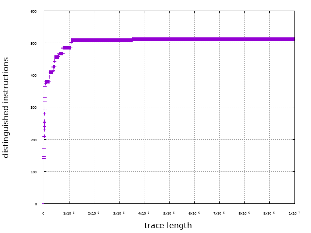

# Deobfuscating an _onion_ obfuscated challenge with REVEN

  We present a code reverse engineering task with our product Reven. The binary examined here is `F4b_XOR_W4kfu`, it is also the challenge of the highest point over all categories (cryptography, exploit, reverse engineering, etc) in the [Grehack 2015's CTF](https://grehack.fr/2015/ctf). The binary is heavily obfuscated, but the obfuscation techniques implemented are novel and interesting.
  
  This is the first article of a series where we introduce our ongoing work in developing an *automated code deobfuscation* system using the *symbolic execution* framework of REVEN. Since our approach is **operational** (i.e. we require some information about how the obfuscation techniques are implemented) this article presents technical details that we discovered in reversing `F4b_XOR_W4kfu`.
  
  *To the our best knowledge, most approaches in binary code deobfuscation are operational, fully denotational approach works in very strict cases only. As a direct consequence of [Rice's theorem](https://en.wikipedia.org/wiki/Rice%27stheorem), learning general programs simply from input/output relation is a well-known undecidable problem. Even for much more restricted contexts, static analysis is [proven to be NP-hard](http://citeseerx.ist.psu.edu/viewdoc/summary?doi=10.1.1.35.2337) for [smartly obfuscated](https://www.cs.ucsb.edu/~chris/research/doc/acsac07limits.pdf) programs. Recent [semantics-based](https://www.cs.arizona.edu/people/debray/Publications/ccs-unvirtualize.pdf) approaches are intrinsically [operational](http://static.usenix.org/event/woot09/tech/full_papers/rolles.pdf); though [some](https://cs.arizona.edu/~debray/Publications/ccs2015-symbolic.pdf) are considered [generic](https://www.cs.arizona.edu/people/debray/Publications/generic-deobf.pdf), they work only on simple cases of very specific obfuscation techniques. However, special classes of loop-free programs can be efficiently [synthesized](http://people.eecs.berkeley.edu/~sseshia/pubdir/synth-icse10.pdf) from input/output with helps of SMT solvers.*
  
### Reven - a very short introduction

  Basically, REVEN Axion is a **system-level symbolic execution** engine,  enriched by code analysis plugins interacting with the core using Python or C/C++ API. One of the essential differences between Reven and other engines is that it does symbolic execution for *all execution threads* presenting on the system, from ring 0 to ring 3. 
  
  In a basic reversing engineering task with Reven, we start by creating a **scenario** which executes the binary in consideration in a virtual machine; the result of the scenario will be used in further analysis. For example, in case of `F4b_XOR_W4kfu` we create a scenario which executes the binary with some input flag, the scenario terminates when the binary stops.
  
  
  
  An advantage of Reven is that it **computes** all instructions being executed, it is virtually immune from anti-debugging/anti-instrumenting tricks that might be applied. But symbolically executed instructions come from all executing threads on the system since a *scenario is system-wide*; but we can always filter instructions executed by the examined binary, the result is somehow equivalent with the execution trace.
  
  *The symbolic execution approach of Reven is different from approaches of debuggers and [dynamic](http://www.dynamorio.org/) [binary](https://software.intel.com/en-us/articles/pin-a-dynamic-binary-instrumentation-tool) [instrumentation](http://valgrind.org/) [tools](http://www.frida.re/) where instructions are still executed on the real hardware, that is still a rich source for [escaping tricks](https://recon.cx/2012/schedule/attachments/42FalconRiva2012.pdf) which exploit [nontransparent effects](https://www.blackhat.com/docs/us-14/materials/us-14-Li-Defeating-The-Transparency-Feature-Of-DBI.pdf) of DBI. Yet, Reven has to pay for this "more transparent" approach, it is normally slower than DBI tools and debuggers.*
  
#### Synchronization with IDA Pro
  Reven is rather a dynamic analysis tool, it has not advanced static analysis features (static disassembly/decompilation, control-flow analysis, etc) that we may normally observe in [other](https://www.hopperapp.com/) [tools](https://www.hex-rays.com/products/ida/) yet, but we can **synchronize** between Reven and IDA Pro (as a "de-facto" reverse code engineering tool) using [qb-sync](https://github.com/quarkslab/qb-sync) to combine the strength of both.
  
  That is enough for self-promoting words :), it's time to take our hand dirty.
  
## Introduction
  
  `F4b_XOR_W4kfu.exe` is a 32 bits PE binary, without any fancy GUI, it asks for a password from the standard input and then prints `Nop!` or `Yes!`. The mission is to find out the good password (one that makes the program print `Yes!`).
  
    ./F4b_XOR_W4kfu.exe 
    Welcome!
    Password? 1234aqzert
    Nop!⏎
  
  The program uses several **obfuscation** techniques to prevent itself from being analyzed. *First*, its execution traces are extremely long taking consideration that the program is *just* a CTF challenge; to get some idea about how long are these trace, after receiving the input, there are 2.716.465.511 instructions executed until the first comparison of the password checking procedure. This is because of a [code decryption/re-encryption](https://www.cosic.esat.kuleuven.be/wissec2006/papers/3.pdf) mechanism and of a [nested multiprocess virtual machine](https://aspire-fp7.eu/spro/wp-content/uploads/SPRO2015_Workshop_Talk_V2.pdf) execution model.
  
  *Second*, the "input related" instructions in a trace are not local, they instead spread out the long trace, that makes difficult to figure out how the input password is manipulated and checked; moreover the password checking algorithm is "mostly" constant time. *Last but not least*, most instructions of the binary are encrypted, they are decrypted just before executing and are immediately re-encrypted later, so we cannot [unpack](http://s3.eurecom.fr/docs/oakland15_packing.pdf) it in the [classical sense](http://ftp.cs.wisc.edu/paradyn/papers/Roundy12Packers.pdf). 
  
  These properties make difficult for direct dynamic/concolic/static analysis. Low-hanging fruit approaches, e.g. black-box attack on counting number of executed instructions, seems not feasible: there is volume of more than 2.7 billion instructions must be passed before reaching the first "input sensitive" comparison
  
## Workaround
  
  The binary has 4 sections, all are marked as executable, writable and executable, how evil it is :-); the section `.frisk0` is simply an ID of all GreHack's binaries, so we are not surprise. The binary starts from `0x402000` which is also the entry point, no TLS callback trick is applied, as confirmed by both Reven and IDA.
  
  Several first instructions are not interesting, for example, the instructions at `0x402008` and `0x402013` are calls to `GetStdHandle`, one at `0x40202c` calls `WriteFile`, and one at `0x402042` calls `ReadFile`. They simply print the strings `Welcome!` and `Password?`, then reads password from the standard input.
  
  
  
  But this short easy reversing time has finished, from now, easy codes do not exist anymore >:)

## Code decryption/re-encryption mechanism

  Passing statically over simple instructions above, the next instructions seem "benign" :-), some `nop`(s), then a `call 0x40400`. However, Reven notices that there are lots of **execution after write** (i.e. some memory addresses are written before getting executed). Some of them are redundant alerts since the process mapping mechanism of `ntoskrnl.exe`, but the first one which really attracts our attention is at `0x402058`: the really executed instruction is `xor eax, eax`, instead of `js 0x40200d` from the static disassembling result.
  
  
  
  *Different form DBI tools and debuggers which work at process level, Reven works at system level, it can trace the [flow of creating a process](https://download.microsoft.com/download/1/4/0/14045A9E-C978-47D1-954B-92B9FD877995/97807356648739_SampleChapters.pdf) (i.e. before the program gets run), here many instructions of the binary are mapped (i.e. written) into the memory using some functions (e.g. `MiCopyOnWrite`) inside `ntoskrnl.exe`, then executed when the program gets run. Consequently, these instructions are redundantly marked as "execution after write".*
  
  From static view in IDA, we can conclude that something following `call 0x40400` has modified the instruction at `0x402058`. We have more detail information with Reven, by backward [dynamic tainting analysis](http://bitblaze.cs.berkeley.edu/papers/taintcheck-full.pdf), it shows a chain of `read/write/execute` on this address, the nearest instruction which writes on the address is at `0x4042fa`, that is `stosb`.
  
  
  
### First virtualization layer
  
  We now know that the binary will modify some instructions before executing them, and this can be revealed by statically analysis the instructions following `call 0x40400`. To get an intuition about what is going on, we extract a partial *control flow graph* from the trace of Reven; the following graph is constructed from a trace of 10.000.000 instructions starting from `0x402048`.
  
  
  (this is a high-resolution image, one may click to it to observe the details)

  *The control flow graph given by Reven is partial since it is constructed based on the dynamic trace computed from running program with a concrete input, but it gives at least some information about which kind of code that we deal with.*
  
  The form of control flow graph suggests that it may be a kind of **virtual machine** with [switch-based dispatcher](http://static.usenix.org/event/woot09/tech/full_papers/rolles.pdf). The typical form of such a VM consists of a dispatcher located in several basic blocks, but there would exist many "non trivial" basic blocks to which control flow is transferred from a much smaller number of "dispatch points". These non trivial basic blocks representing opcodes can be, for example, ones start with the instruction at `0x402513`, `0x40206a`, `0x4025d`, etc; the control flow transferred to all of them comes from the basic block ends with `0x4042e0`, which may be supposed that this is the *dispatch point* of the dispatcher. Moreover, these basic blocks transfer control flow to the same basic block start with the address `0x404000` (since they both end with `call 0x404000`), which may be supposed that this is the *entry point* of the dispatcher.
  
  There are also basic blocks, for example, ones start with `0x4043a4`, `0x404371`, `0x40428c`, etc; they might not represent opcodes since their semantics is trivial, just a simple unconditional`jmp 0x40428`.
  
  Another indication which suggests that this is possibly a VM, is the number of distinguished instructions over the total number of executed instructions. Since the number of "virtual instructions" is normally much smaller than the number of the real hardware instructions (i.e.`x86` ISA), we would normally observe that there are not "too much" distinguished instructions in a binary obfuscated by a VM. The following diagram presents the number of distinguished instructions over the trace length (computed inside 10.000.000 instructions), we can observe that there is only about 500 distinguished instructions over a trace of length 10.000.000!!!
  
  

  Our intuition is now that there is VM whose entry point starts with `0x404000`, and single dispatch point ends at `0x4042e0`, recovering the original control flow is just a trivial task. But we do not understand how it works yet :-).
  
  *The similar form of control flow graph can be observed in binaries obfuscated by [VMProtect](http://vmpsoft.com/), but we cannot observe this form in binaries obfuscated by [Code Virtualizer](http://oreans.com/codevirtualizer.php) since this obfuscator uses [threaded code](http://home.claranet.nl/users/mhx/ForthBell.pdf) instead of switch-based dispatcher, the control flow to the next opcode's basic block will be calculated at the end of the current opcode's basic block. In some other VM obfuscated binaries, e.g. [HyperUnpackMe2](http://crackmes.de/users/thehyper/hyperunpackme2/), its dispatcher has even several dispatch points, the [detail analysis](http://www.openrce.org/articles/fullview/28) of this has given by Rolf Rolles.*
  
#### Internal detail of the first virtual machine

  The results obtained above gives us a "hint" about the kind of obfuscation, to understand in details how it works, we need careful analysis its dispatcher, whose the entry point is at `0x404000`. The first part of it, can be observed easily from IDA Pro or Reven, has the following control flow graph.
