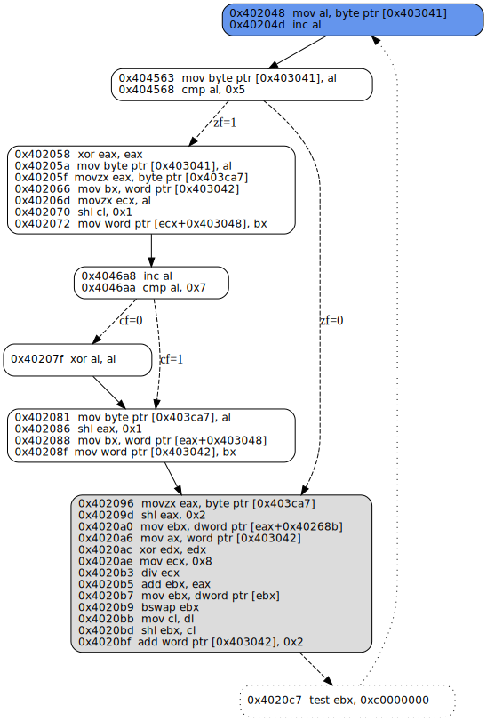
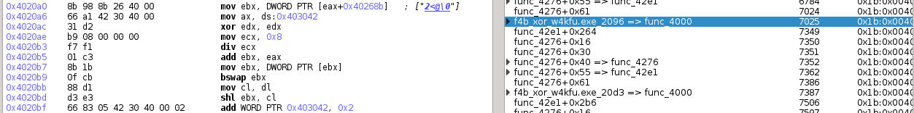
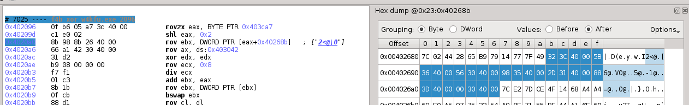
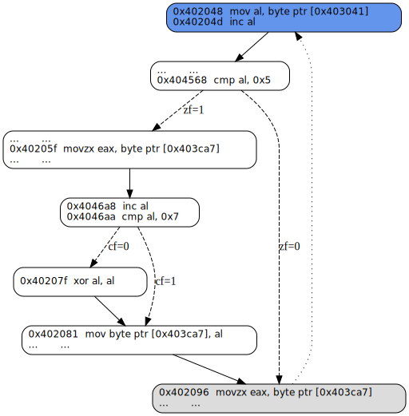
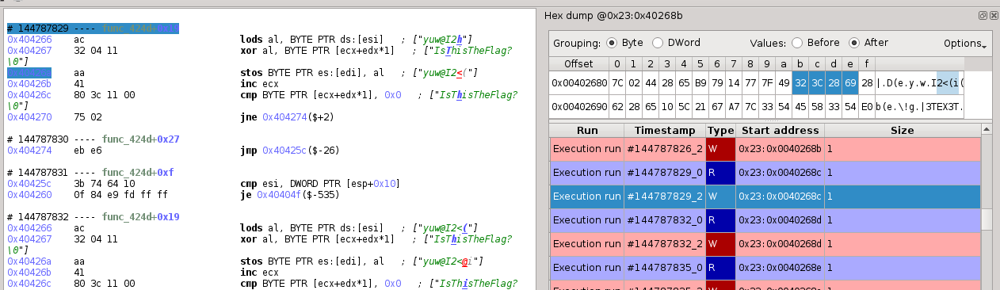
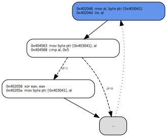
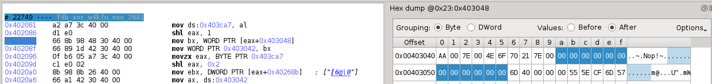
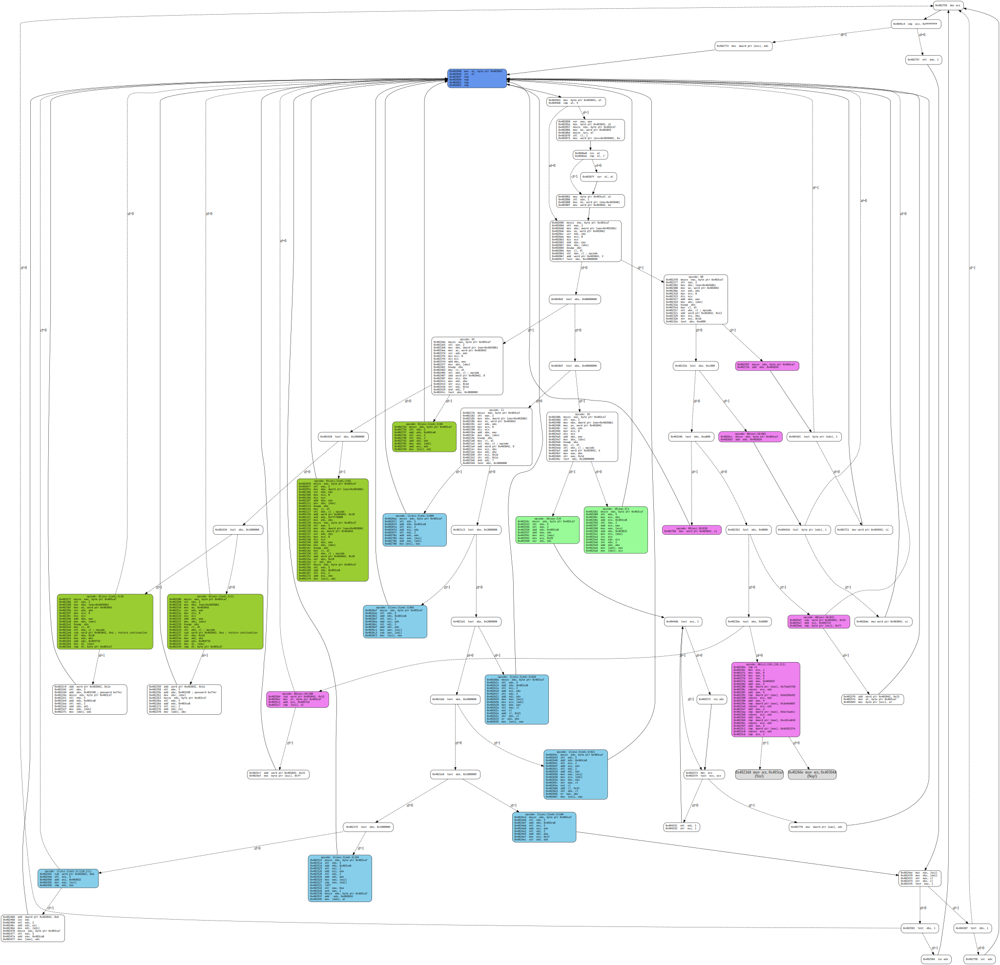
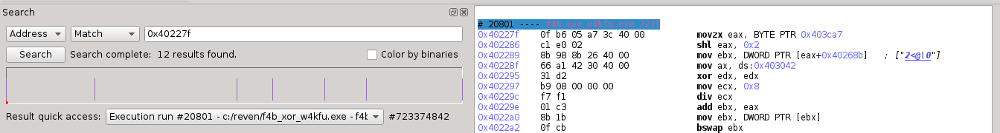
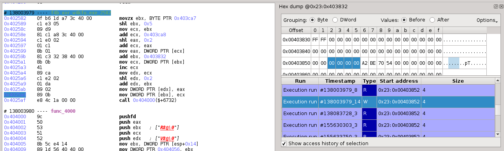

<!-- Title: Unfolding obfuscated code with Reven (part 2) -->
<!-- Date: 2016-12-06 17:25 -->
<!-- Tags: reverse engineering, deobfuscation, ctf -->
<!-- Category: Technical -->
<!-- Author: tdta -->
<!-- Slug: reversing-f4b-challenge-part1 -->

  Last time, by abstracting the runtime effect of the first virtual machine, we have reduced the challenge to a simpler but **semantically equivalent** program. Its control flow graph has a unique *entry point* as the basic block starting at `0x402048`, whereas ones at `0x4023d4` and at `0x40266e` are  *exit points* corresponding to the case where the program prints `Yes!` and `Nop!`.

## Loops analysis ##

  It is quite direct to identify [natural loops](https://en.wikipedia.org/wiki/Control_flow_graph) this graph. Indeed, the entry point block is also the root of the *dominator tree*; there are *back-edges*, e.g. from the block starting at `0x402460` to the entry point, or from one at `0x402513` to the entry point, etc. These back edges form natural loops which have a common *header* (that is the entry point), then can be combined into a single natural loop. There are also some *nested loops*, e.g. one having the basic block `0x4044d6` as its header and `0x404331 -> 0x4044d6` as its back-edge.

  The program terminates by calling `ExitProcess` either at the block `0x4023d4` or `0x40266e` (respectively for `Nop` or `Yes!`), moreover the exit block (i.e. one at `0x40235`) *post-dominates* these terminating blocks. For comprehension purpose, we can "add" pseudo back-edges `0x4023d4 -> 0x402048` and `0x40266e -> 0x402048` without changing the semantics of the program. Consequently, it can be interpreted as a single "high-level" `while (true)` loop, with several loops nested within.

  <!-- **Remark:** -->
  <!-- Some properties about the dominance relation between basic blocks can be quickly checked on Reven-Axion. For example, the block `0x403048` is an immediate dominator of `0x404563` then their number of occurrences on the trace must be the same; indeed this number is `178217` for each, this corresponds also to the number of iterations of the outer-most loop. Or the blocks `0x402058` and `0x402096` have the unique post dominator `0x404563` then their sum of occurrences must equal to the number of occurrences of `0x404563`. -->

  The program is "just" a loop, would life be easy from now? Not this time, unfortunately :-). Welcome to the world of bit-level and multi-process virtual machines.

## Reversing the second virtual machine ##

  We can quickly recognize a "pattern" in the loop. There are "top" blocks, i.e. ones starting at `0x402048`, `0x404563`, `0x402058`, `0x4046a8`, `0x40207f`, `0x402081` and `0x402096`, which seems to be used to extract some value into `ebx`. Next, there are tests on `ebx` with some constants (e.g. at `0x4020d3`, `0x4020c7`, etc.), and depending on the results of tests, there are corresponding "bottom" blocks, (e.g. at `0x4022f8`, `0x4023de`, `0x40217b`, `0x402486`, .etc) which seems to do the real things.

  This pattern suggests us to think of a **virtual machine** with switch-based dispatcher again: the higher blocks might correspond with the dispatcher whereas the lower ones might correspond with opcodes.

### Dispatcher ###

  Let's consider the higher basic blocks and their control flow, consisting of in the following control flow graph. They form a [region](http://digital.cs.usu.edu/~allan/AdvComp/Notes/controld/controld.html) whose the header is the block at `0x402048`, there is even a unique exit block at `0x402096`. This is an useful property since we can safely isolate the [data-flow analysis](https://en.wikipedia.org/wiki/Data-flow_analysis) on these blocks from other parts of the program.

  

  **Remark:**
  *for comprehension purpose, we have omitted `nop`(s) from basic blocks; the instruction `test ebx, ...` is split from the exit block, so it is not included in the region. We have added also a "pseudo" back-edge from the lowest block to the entry point to imply that the dispatcher is executed through a loop.*

  Indeed, we observe that this region accesses `5` different memory addresses: `0x403041` (byte access), `0x403ca7` (byte access), `0x403042` (word access), `0x40268b` (double word access). Moreover, a simple [liveness analysis](https://en.wikipedia.org/wiki/Live_variable_analysis) shows that all accessed registers are *dead* before entering the header block; except `ebx`, they are also *dead* when going out the exit block. Consequently, the region is completely "parameterized" by values at these memory addresses.

#### <a id="bitlevelaccess">Bit-level access</a> ####

  To recover the semantics of the region, we notice an interesting pattern in the exit block (which occurs also at lower basic blocks, e.g. at `0x4023de`, `0x4022f8`, etc). That is the following sequence of instruction:

  

  which can be interpreted as:

    mov ebx, dword ptr [eax+0x40268b]  ; ebx = address of a byte array
    mov ax, word ptr [0x403042]        ; eax = a bit-level offset
    xor edx, edx
    mov ecx, 0x8
    div ecx                            ; eax = eax / 8 (byte-level offset)
    add ebx, eax                       ; ebx = address of the element at this offset in the array
    mov ebx, dword ptr [ebx]           ; get the dword at this address
    bswap ebx                          ; most significant byte of ebx becomes the byte at the address
    mov cl, dl                         ; note: edx = eax % 8 (bit-level remainder)
    shl ebx, cl                        ; remove remainder bits and round ebx

  As explained in the comments above, given some offset `i` in bits, the sequence extracts a `dword` in a byte array from the **bit-offset** `i`, the extracted value is rounded to `2^(i % 8)`.

  This bit-level data extracting pattern is repeated at other blocks, the control flow is diverted by `test ebx, ...` instructions depending on the extracted value. More concretely, for each "kind" of the extracted data, there is a unique corresponding operator that is consisted in a single block (e.g. ones at `0x402250`, `0x40263c`, etc.), or in several blocks (e.g. one consisted of blocks at `0x404d6`, `0x402572`, `0x402573`, `0x404331`, etc.). That is a "strong" indication of a virtual machine (well, "strong" but it is just a guesswork, actually).

<!-- #### Multitasking virtual machine #### -->
#### Opcode tables ####

  We now examine the array where bit-level data is extracted (i.e. the opcode table). First, noticing that the bit-offset is typed as `word` value at `0x403042`. Moreover, the address of the opcode table is indexed by `eax` in a `dword` array at `0x40268b`:

    0x4020a0  mov ebx, dword ptr [eax+0x40268b]

  whereas `eax` is calculated by:

    0x402096  movzx eax, byte ptr [0x403ca7]
    0x40209d  shl eax, 0x2

  Examining on REVEN-Axion the [memory access](#memaccess403ca7) at `0x403ca7`, we observe that the `byte` value stored at this address is *periodically increased* from `0` to `6` (we call it `opcode table ID`):

    0, 1, 2, 3, 4, 5, 6, 0, 1, 2, 3,...

  

  and when examining corresponding `dword`(s) starting at `0x40268b`, we receive the following values:

    0x403c32, 0x40365b, 0x403056, 0x403598, 0x403121, 0x403d88, 0x403000

  

  each is the base address of an opcode table, so we get `7` different tables!!! Ok, a virtual machine with multiple opcode tables, that's nice :-)

  The periodic increment from `0` to `6` of `opcode table id` is revealed also in the following static [slice](https://en.wikipedia.org/wiki/Program_slicing) of the [dispatcher](#dispatchercfg) with respect to the point of interest at `0x402096` and the value of `eax`.

  

  **Remark:**
  *if we examine `dword` values at `0x40268b` following the execution trace, we will see that they are not constant :-), i.e. they are not always `0x403c32`, `0x40365b`, etc. We should remember that the binary is split into multiple gadges which are repeatedly encrypted/decrypted, there is only one being in cleartext at a given time). But they keep always these values when they are read to get the opcode table.*

  

#### Instruction pointers ####

  As examined [above](#bit-level-access), in extracting data at each opcode table, the bit-level offset is read as a `word` at `0x403042`:

    0x4020a6  mov ax, word ptr [0x403042]

  moreover, we observe that this value is indexed also by the ID of the opcode table in a `word` array at `0x403048`:

    0x402081  mov byte ptr [0x403ca7], al      ; table ID
    0x402086  shl eax, 0x1
    0x402088  mov bx, word ptr [eax+0x403048]  ; bit-level offset
    0x40208f  mov word ptr [0x403042], bx

  Also, this is nothing surprising (the dispatcher is not obfuscated :-)) that this offset is updated back to the array by:

    0x40205f  movzx eax, byte ptr [0x403ca7]   ; table ID
    0x402066  mov bx, word ptr [0x403042]      ; bit-level offset
    0x40206d  movzx ecx, al
    0x402070  shl cl, 0x1
    0x402072  mov word ptr [ecx+0x403048], bx  ; update

  So for each `opcode table ID`, we have a corresponding pair of `(opcode table, bit-level offset)`. Well, noticing now that each offset can be interpreted as the `instruction pointer` (abbr. `VmIP`) of a virtual machine, that means... not one, but... there are indeed `7` **concurrent virtual machines** corresponding with `opcode table ID`(s) from `0` to `6`, each has its own code and instruction pointer, and they share the same dispatcher and opcode handlers, WtF %$*#~@!!!.

#### Multitasking ####

  These concurrent VM(s) can be seen as concurrent (virtual) processes, we then call the `opcode table ID` `VpID` hereafter. [Observing](#dispatchercfg) that if the value of `al` in the instruction at `0x044568` is not `5` then `VpID` is kept, and so does the opcode table address; the  bit-level offset (i.e. the instruction pointer) is not extracted (resp. updated) from (resp. to) the instruction pointer table (i.e. `word` array at `0x403048`), it is simply increased when data is extracted from the corresponding opcode table. Otherwise, the `VpID` is periodically increased, and the corresponding opcode table as well as `instruction pointer` will be used. In other words, if `al` is not `5` then the same

  We notice that the value above of `al` is extracted as the `byte` value at `0x403041`, slicing the dispatcher with respect to this `byte`, we receive the [control flow graph](#timeslicingcfg) below. It shows that each virtual machine will *execute exactly `5` opcodes*, then switch to the periodically next virtual machine. This is nothing but a **preemptive multitasking** execution model of `7` processes, each has a time-slice of `5` instructions.

  

#### Entry points ####

 

 The instruction pointer of the virtual process `VpID` is accessed/retrieved as `word ptr Ox403048[VmID]`. Except the process `0` whose the `VmIP` is retrieved at the first time from `word ptr [0x403042]` (since the time-slice is [initialized by `0`](#timesliceinitialization)), others has their `VmIP` are [retrieved at the first time](#entrypoints) from `word ptr Ox403048[VmID]`. In any case, the instruction pointer of each process is initialized by `0`, or the **entry point** of each process is `0`.

 

#### <a id="virtualprocesssummary">Summary</a> ####

  We have reversed completely the dispatcher of the second virtual machine. This "non-obfuscated" devil consists of `7` "virtual" processes, identified by a `VpID` ranged in `[0, 6]`, each

  * has the address of opcode table as `dword ptr 0x40268b[VpID]`,
  * executes in a time-slice of `5` instructions before switching to the periodically next process,
  * has a bit-level instruction pointer, and its entry point `0`.

### Instruction set ###

  We have reversed the instruction (i.e. opcode) tables of all processes. Our purpose is to completely *decompile* them, then the natural next step is to reverse the instruction set of the virtual machine.

  As previously noticed, the instruction handlers are located at "bottom" basic blocks. We observe also that the "bit extraction" [pattern](#bitlevelaccess) appears all over these blocks, this is no surprise: the VM uses the pattern to extract instructions (in the instruction tables), each consists in several consecutive bits.
  <!--It is a repetitive task in presenting step-by-step how instructions are extracted, moreover some of them have similar semantics; so we will present below how they are classified into several class and the format of each.-->

#### Instruction classes ####

  Following the *instruction format*, the instruction set can be divided into `4` classes; we illustrate each class by a color in the following [control flow graph](#controlflowgraph): the basic blocks handling the instructions of the same class have assigned the same color.

  

  Below, let `vI` denote a value `v` of `I` bit, each instruction is denoted by it syntax  (e.g. `00|v16|v3` consists of instructions having first `2` bits `0`, then some value encoded in `16` bits, and some value encoded in `3` bits). `pID` denotes the `byte` value stored in `[0x403ca7]` and `0x403ca8[i][j]` is a `dword` element of the array `7x7` starting from `0x403ca8`. The semantics of instructions in each class is revealed in the following pseudo code C.

  * `00|v16|v3`:
   + `00|a16|000`: `if (0x403654[pID] == 0x1) then goto a16`
   + `00|a16|001`: `if (0x403654[pID] != 0x1) then goto a16`
   + `00|a16|010`: `goto a16`
   + `00|o16|011`: `if (0x403732[o16] != 0xff) then goto +0 else 0x403732[o16] = pID`
   + `00|o16|100`: `if (0x403732[o16] != pID) then goto +0 else 0x403732[o16] = 0xff`
   + `00|v16|(101,110,111)` : `check_password()`
  * `01|a3|b3|v2`:
   + `01|a3|b3|00`: `dw 0x403ca8[pID][a3] = dw 0x403ca8[pID][b3]`,
   + `01|a3|b3|01`: `0x403ca8[pID][a3] = v32` (`v32` is calculated as `x16|y16`, where the `x16` and `y16` are extracted consecutively as `16` bit values, next to the current instruction)
   + `01|a3|b3|10`: `if (0x403732[v16] == pID) then password[v16] = 0x403ca8[pID][b3] else goto +0` (where `v16` is extracted as `16` bit value, next to the current instruction)
   + `01|a3|b3|11`: `if (0x403732[o16] == pID) then 0x403ca8[pID][a3] = password[v16] else goto +0` (the value`v16` is extracted similarly as above)
  + `10|v3|v1`:
   + `10|v3|0`: `0x403ca8[pID][v3] = bit_reverse(0x403ca8[pID][v3])` (the function `bit_reverse` reverses bits of a `32` bit value, i.e. bit `0` becomes `31`, bit `1` become `30`, etc)
   + `10|v3|1`: `tmp_ecx = ++0x403832[pID][0]; 0x403832[pID][tmp_ecx] = 0x403ca8[pID][v3]`
  + `11|a3|b3|v3`:
   + `11|a3|b3|000`: `0x403ca8[pID][a3] += 0x403ca8[pID][b3]`
   + `11|a3|b3|001`: `0x403ca8[pID][a3] -= 0x403ca8[pID][b3]`
   + `11|a3|b3|010`: `0x403ca8[pID][a3] = rol(0x403ca8[pID][a3], 0x403ca8[pID][b3])`
   + `11|a3|b3|011`: `0x403ca8[pID][a3] = ror(0x403ca8[pID][a3], 0x403ca8[pID][b3])`
   + `11|a3|b3|100`: `0x403ca8[pID][a3] = 0x403ca8[pID][b3] ^ 0x403ca8[pID][a3]`
   + `11|a3|b3|101`: `0x403654[pID] = (0x403ca8[pID][a3] == 0x403ca8[pID][b3])`
   + `11|a3|b3|(110,111)`: `if (b3 < 0x403832[a3][0]) then 0x403ca8[pID][a3][b3 + 1] else goto +0`

where `password` is nothing but the buffer at `0x403198` containing the input password.

  **Remark:**
  Without an explicit type annotation (e.g. `w` for `word`, `dw` for double `word`, etc.), array access operator `[]` is typed to return `byte`, also types are omitted when they are clear from the context (i.e. can be referenced).

### Disasembling, decompiling and semantics of concurrent processes ###

  We now know both *syntax and semantics* of the instruction set, the *opcode table* and *entry point* of each virtual process have been also [revealed](#virtualprocesssummary), we then implement a [recursive traversal disassembler](http://dl.acm.org/citation.cfm?id=885138) which gives the following result (the numbers on the left are bit-offsets of instructions):

  Process `0`:

    0x000: 0x403ca8[0][2] = 0x550342b8;
    0x02a: if (0x403732[0] != 0xff) then goto 0x02a else 0x403732[0] = 0x00;
    0x03f: if (0x403732[0] == 0x00) then 0x403ca8[0][1] = password[0] else goto 0x03f;
    0x059: 0x403ca8[0][1] += 0x403ca8[0][2];
    0x064: if (0x403732[0] == 0x00) then password[0] = 0x403ca8[0][1] else goto 0x064;
    0x07e: if (0x403732[0] != 0x00) then goto 0x07e else 0x403732[0] = 0xff;
    0x093: 0x403ca8[0][2] = 0xe3348f8b;
    0x0bd: if (0x403732[1] != 0xff) then goto 0x0bd else 0x403732[1] = 0x00;
    0x0d2: if (0x403732[1] == 0x00) then 0x403ca8[0][1] = password[1] else goto 0x0d2;
    0x0ec: 0x403ca8[0][1] += 0x403ca8[0][2];
    0x0f7: if (0x403732[1] == 0x00) then password[1] = 0x403ca8[0][1] else goto 0x0f7;
    0x111: if (0x403732[1] != 0x00) then goto 0x111 else 0x403732[1] = 0xff;
    0x126: 0x403ca8[0][2] = 0x58c85bdd;
    0x150: if (0x403732[2] != 0xff) then goto 0x150 else 0x403732[2] = 0x00;
    0x165: if (0x403732[2] == 0x00) then 0x403ca8[0][1] = password[2] else goto 0x165;
    0x17f: 0x403ca8[0][1] += 0x403ca8[0][2];
    0x18a: if (0x403732[2] == 0x00) then password[2] = 0x403ca8[0][1] else goto 0x18a;
    0x1a4: if (0x403732[2] != 0x00) then goto 0x1a4 else 0x403732[2] = 0xff;
    0x1b9: 0x403ca8[0][2] = 0x7406e41c;
    0x1e3: if (0x403732[3] != 0xff) then goto 0x1e3 else 0x403732[3] = 0x00;
    0x1f8: if (0x403732[3] == 0x00) then 0x403ca8[0][1] = password[3] else goto 0x1f8;
    0x212: 0x403ca8[0][1] += 0x403ca8[0][2];
    0x21d: if (0x403732[3] == 0x00) then password[3] = 0x403ca8[0][1] else goto 0x21d;
    0x237: if (0x403732[3] != 0x00) then goto 0x237 else 0x403732[3] = 0xff;
    0x24c: 0x403ca8[0][2] = 0x72ece789;
    0x276: if (0x403732[4] != 0xff) then goto 0x276 else 0x403732[4] = 0x00;
    0x28b: if (0x403732[4] == 0x00) then 0x403ca8[0][1] = password[4] else goto 0x28b;
    0x2a5: 0x403ca8[0][1] += 0x403ca8[0][2];
    0x2b0: if (0x403732[4] == 0x00) then password[4] = 0x403ca8[0][1] else goto 0x2b0;
    0x2ca: if (0x403732[4] != 0x00) then goto 0x2ca else 0x403732[4] = 0xff;
    0x2df: 0x403ca8[0][2] = 0xefa2f7ec;
    0x309: if (0x403732[5] != 0xff) then goto 0x309 else 0x403732[5] = 0x00;
    0x31e: if (0x403732[5] == 0x00) then 0x403ca8[0][1] = password[5] else goto 0x31e;
    0x338: 0x403ca8[0][1] += 0x403ca8[0][2];
    0x343: if (0x403732[5] == 0x00) then password[5] = 0x403ca8[0][1] else goto 0x343;
    0x35d: if (0x403732[5] != 0x00) then goto 0x35d else 0x403732[5] = 0xff;
    0x372: goto 0x000;

  Process `1`:

    0x000: 0x403ca8[1][5] = 0x00000001;
    0x02a: 0x403ca8[1][2] = 0x6dc555e2;
    0x054: 0x403ca8[1][3] = 0x0000001f;
    0x07e: 0x403ca8[1][4] = 0x0000036d;
    0x0a8: if (0x403732[0] != 0xff) then goto 0x0a8 else 0x403732[0] = 0x01;
    0x0bd: if (0x403732[0] == 0x01) then 0x403ca8[1][1] = password[0] else goto 0x0bd;
    0x0d7: 0x403ca8[1][6] = 0x403ca8[1][6] ^ 0x403ca8[1][6];
    0x0e2: 0x403ca8[1][1] = 0x403ca8[1][2] ^ 0x403ca8[1][1];
    0x0ed: 0x403ca8[1][1] = rol(0x403ca8[1][1], 0x403ca8[1][3]);
    0x0f8: 0x403ca8[1][6] += 0x403ca8[1][5];
    0x103: 0x403654[1] = (0x403ca8[1][6] == 0x403ca8[1][4]);
    0x10e: if (0x403654[1] != 0x01) then goto 0x0e2;
    0x123: if (0x403732[0] != 0x01) then goto 0x123 else 0x403732[0] = 0xff;
    0x138: tmp_ecx = ++0x403832[1][0]; 0x403832[1][tmp_ecx] = 0x403ca8[1][1];
    0x13e: 0x403ca8[1][2] = 0x668471f5;
    0x168: 0x403ca8[1][3] = 0x00000013;
    0x192: 0x403ca8[1][4] = 0x00000305;
    0x1bc: if (0x403732[1] != 0xff) then goto 0x1bc else 0x403732[1] = 0x01;
    0x1d1: if (0x403732[1] == 0x01) then 0x403ca8[1][1] = password[1] else goto 0x1d1;
    0x1eb: 0x403ca8[1][6] = 0x403ca8[1][6] ^ 0x403ca8[1][6];
    0x1f6: 0x403ca8[1][1] = 0x403ca8[1][2] ^ 0x403ca8[1][1];
    0x201: 0x403ca8[1][1] = rol(0x403ca8[1][1], 0x403ca8[1][3]);
    0x20c: 0x403ca8[1][6] += 0x403ca8[1][5];
    0x217: 0x403654[1] = (0x403ca8[1][6] == 0x403ca8[1][4]);
    0x222: if (0x403654[1] != 0x01) then goto 0x1f6;
    0x237: if (0x403732[1] != 0x01) then goto 0x237 else 0x403732[1] = 0xff;
    0x24c: tmp_ecx = ++0x403832[1][0]; 0x403832[1][tmp_ecx] = 0x403ca8[1][1];
    0x252: 0x403ca8[1][2] = 0x21f8a104;
    0x27c: 0x403ca8[1][3] = 0x00000010;
    0x2a6: 0x403ca8[1][4] = 0x000001e6;
    0x2d0: if (0x403732[2] != 0xff) then goto 0x2d0 else 0x403732[2] = 0x01;
    0x2e5: if (0x403732[2] == 0x01) then 0x403ca8[1][1] = password[2] else goto 0x2e5;
    0x2ff: 0x403ca8[1][6] = 0x403ca8[1][6] ^ 0x403ca8[1][6];
    0x30a: 0x403ca8[1][1] = 0x403ca8[1][2] ^ 0x403ca8[1][1];
    0x315: 0x403ca8[1][1] = rol(0x403ca8[1][1], 0x403ca8[1][3]);
    0x320: 0x403ca8[1][6] += 0x403ca8[1][5];
    0x32b: 0x403654[1] = (0x403ca8[1][6] == 0x403ca8[1][4]);
    0x336: if (0x403654[1] != 0x01) then goto 0x30a;
    0x34b: if (0x403732[2] != 0x01) then goto 0x34b else 0x403732[2] = 0xff;
    0x360: tmp_ecx = ++0x403832[1][0]; 0x403832[1][tmp_ecx] = 0x403ca8[1][1];
    0x366: 0x403ca8[1][2] = 0x0d665e60;
    0x390: 0x403ca8[1][3] = 0x0000001a;
    0x3ba: 0x403ca8[1][4] = 0x000001d5;
    0x3e4: if (0x403732[3] != 0xff) then goto 0x3e4 else 0x403732[3] = 0x01;
    0x3f9: if (0x403732[3] == 0x01) then 0x403ca8[1][1] = password[3] else goto 0x3f9;
    0x413: 0x403ca8[1][6] = 0x403ca8[1][6] ^ 0x403ca8[1][6];
    0x41e: 0x403ca8[1][1] = 0x403ca8[1][2] ^ 0x403ca8[1][1];
    0x429: 0x403ca8[1][1] = rol(0x403ca8[1][1], 0x403ca8[1][3]);
    0x434: 0x403ca8[1][6] += 0x403ca8[1][5];
    0x43f: 0x403654[1] = (0x403ca8[1][6] == 0x403ca8[1][4]);
    0x44a: if (0x403654[1] != 0x01) then goto 0x41e;
    0x45f: if (0x403732[3] != 0x01) then goto 0x45f else 0x403732[3] = 0xff;
    0x474: tmp_ecx = ++0x403832[1][0]; 0x403832[1][tmp_ecx] = 0x403ca8[1][1];
    0x47a: 0x403ca8[1][2] = 0x69fd3480;
    0x4a4: 0x403ca8[1][3] = 0x00000007;
    0x4ce: 0x403ca8[1][4] = 0x000000cc;
    0x4f8: if (0x403732[4] != 0xff) then goto 0x4f8 else 0x403732[4] = 0x01;
    0x50d: if (0x403732[4] == 0x01) then 0x403ca8[1][1] = password[4] else goto 0x50d;
    0x527: 0x403ca8[1][6] = 0x403ca8[1][6] ^ 0x403ca8[1][6];
    0x532: 0x403ca8[1][1] = 0x403ca8[1][2] ^ 0x403ca8[1][1];
    0x53d: 0x403ca8[1][1] = rol(0x403ca8[1][1], 0x403ca8[1][3]);
    0x548: 0x403ca8[1][6] += 0x403ca8[1][5];
    0x553: 0x403654[1] = (0x403ca8[1][6] == 0x403ca8[1][4]);
    0x55e: if (0x403654[1] != 0x01) then goto 0x532;
    0x573: if (0x403732[4] != 0x01) then goto 0x573 else 0x403732[4] = 0xff;
    0x588: tmp_ecx = ++0x403832[1][0]; 0x403832[1][tmp_ecx] = 0x403ca8[1][1];
    0x58e: 0x403ca8[1][2] = 0xe4b8c392;
    0x5b8: 0x403ca8[1][3] = 0x00000012;
    0x5e2: 0x403ca8[1][4] = 0x0000025d;
    0x60c: if (0x403732[5] != 0xff) then goto 0x60c else 0x403732[5] = 0x01;
    0x621: if (0x403732[5] == 0x01) then 0x403ca8[1][1] = password[5] else goto 0x621;
    0x63b: 0x403ca8[1][6] = 0x403ca8[1][6] ^ 0x403ca8[1][6];
    0x646: 0x403ca8[1][1] = 0x403ca8[1][2] ^ 0x403ca8[1][1];
    0x651: 0x403ca8[1][1] = rol(0x403ca8[1][1], 0x403ca8[1][3]);
    0x65c: 0x403ca8[1][6] += 0x403ca8[1][5];
    0x667: 0x403654[1] = (0x403ca8[1][6] == 0x403ca8[1][4]);
    0x672: if (0x403654[1] != 0x01) then goto 0x646;
    0x687: if (0x403732[5] != 0x01) then goto 0x687 else 0x403732[5] = 0xff;
    0x69c: tmp_ecx = ++0x403832[1][0]; 0x403832[1][tmp_ecx] = 0x403ca8[1][1];
    0x6a2: goto 0x6a2;

  Process `2`:

    0x000: 0x403ca8[2][5] = 0x00000001;
    0x02a: 0x403ca8[2][2] = 0xecf6d571;
    0x054: 0x403ca8[2][3] = 0x0000000e;
    0x07e: 0x403ca8[2][4] = 0x0000006e;
    0x0a8: if (0x403732[0] != 0xff) then goto 0x0a8 else 0x403732[0] = 0x02;
    0x0bd: if (0x403732[0] == 0x02) then 0x403ca8[2][1] = password[0] else goto 0x0bd;
    0x0d7: 0x403ca8[2][6] = 0x403ca8[2][6] ^ 0x403ca8[2][6];
    0x0e2: 0x403ca8[2][1] -= 0x403ca8[2][2];
    0x0ed: 0x403ca8[2][1] = ror(0x403ca8[2][1], 0x403ca8[2][3]);
    0x0f8: 0x403ca8[2][6] += 0x403ca8[2][5];
    0x103: 0x403654[2] = (0x403ca8[2][6] == 0x403ca8[2][4]);
    0x10e: if (0x403654[2] != 0x01) then goto 0x0e2;
    0x123: if (0x403732[0] != 0x02) then goto 0x123 else 0x403732[0] = 0xff;
    0x138: tmp_ecx = ++0x403832[2][0]; 0x403832[2][tmp_ecx] = 0x403ca8[2][1];
    0x13e: 0x403ca8[2][2] = 0xec829194;
    0x168: 0x403ca8[2][3] = 0x00000010;
    0x192: 0x403ca8[2][4] = 0x0000020d;
    0x1bc: if (0x403732[1] != 0xff) then goto 0x1bc else 0x403732[1] = 0x02;
    0x1d1: if (0x403732[1] == 0x02) then 0x403ca8[2][1] = password[1] else goto 0x1d1;
    0x1eb: 0x403ca8[2][6] = 0x403ca8[2][6] ^ 0x403ca8[2][6];
    0x1f6: 0x403ca8[2][1] -= 0x403ca8[2][2];
    0x201: 0x403ca8[2][1] = ror(0x403ca8[2][1], 0x403ca8[2][3]);
    0x20c: 0x403ca8[2][6] += 0x403ca8[2][5];
    0x217: 0x403654[2] = (0x403ca8[2][6] == 0x403ca8[2][4]);
    0x222: if (0x403654[2] != 0x01) then goto 0x1f6;
    0x237: if (0x403732[1] != 0x02) then goto 0x237 else 0x403732[1] = 0xff;
    0x24c: tmp_ecx = ++0x403832[2][0]; 0x403832[2][tmp_ecx] = 0x403ca8[2][1];
    0x252: 0x403ca8[2][2] = 0x5c167e65;
    0x27c: 0x403ca8[2][3] = 0x0000000d;
    0x2a6: 0x403ca8[2][4] = 0x000001d7;
    0x2d0: if (0x403732[2] != 0xff) then goto 0x2d0 else 0x403732[2] = 0x02;
    0x2e5: if (0x403732[2] == 0x02) then 0x403ca8[2][1] = password[2] else goto 0x2e5;
    0x2ff: 0x403ca8[2][6] = 0x403ca8[2][6] ^ 0x403ca8[2][6];
    0x30a: 0x403ca8[2][1] -= 0x403ca8[2][2];
    0x315: 0x403ca8[2][1] = ror(0x403ca8[2][1], 0x403ca8[2][3]);
    0x320: 0x403ca8[2][6] += 0x403ca8[2][5];
    0x32b: 0x403654[2] = (0x403ca8[2][6] == 0x403ca8[2][4]);
    0x336: if (0x403654[2] != 0x01) then goto 0x30a;
    0x34b: if (0x403732[2] != 0x02) then goto 0x34b else 0x403732[2] = 0xff;
    0x360: tmp_ecx = ++0x403832[2][0]; 0x403832[2][tmp_ecx] = 0x403ca8[2][1];
    0x366: 0x403ca8[2][2] = 0x3950cc83;
    0x390: 0x403ca8[2][3] = 0x0000001e;
    0x3ba: 0x403ca8[2][4] = 0x00000318;
    0x3e4: if (0x403732[3] != 0xff) then goto 0x3e4 else 0x403732[3] = 0x02;
    0x3f9: if (0x403732[3] == 0x02) then 0x403ca8[2][1] = password[3] else goto 0x3f9;
    0x413: 0x403ca8[2][6] = 0x403ca8[2][6] ^ 0x403ca8[2][6];
    0x41e: 0x403ca8[2][1] -= 0x403ca8[2][2];
    0x429: 0x403ca8[2][1] = ror(0x403ca8[2][1], 0x403ca8[2][3]);
    0x434: 0x403ca8[2][6] += 0x403ca8[2][5];
    0x43f: 0x403654[2] = (0x403ca8[2][6] == 0x403ca8[2][4]);
    0x44a: if (0x403654[2] != 0x01) then goto 0x41e;
    0x45f: if (0x403732[3] != 0x02) then goto 0x45f else 0x403732[3] = 0xff;
    0x474: tmp_ecx = ++0x403832[2][0]; 0x403832[2][tmp_ecx] = 0x403ca8[2][1];
    0x47a: 0x403ca8[2][2] = 0x604dc3f2;
    0x4a4: 0x403ca8[2][3] = 0x00000001;
    0x4ce: 0x403ca8[2][4] = 0x0000002b;
    0x4f8: if (0x403732[4] != 0xff) then goto 0x4f8 else 0x403732[4] = 0x02;
    0x50d: if (0x403732[4] == 0x02) then 0x403ca8[2][1] = password[4] else goto 0x50d;
    0x527: 0x403ca8[2][6] = 0x403ca8[2][6] ^ 0x403ca8[2][6];
    0x532: 0x403ca8[2][1] -= 0x403ca8[2][2];
    0x53d: 0x403ca8[2][1] = ror(0x403ca8[2][1], 0x403ca8[2][3]);
    0x548: 0x403ca8[2][6] += 0x403ca8[2][5];
    0x553: 0x403654[2] = (0x403ca8[2][6] == 0x403ca8[2][4]);
    0x55e: if (0x403654[2] != 0x01) then goto 0x532;
    0x573: if (0x403732[4] != 0x02) then goto 0x573 else 0x403732[4] = 0xff;
    0x588: tmp_ecx = ++0x403832[2][0]; 0x403832[2][tmp_ecx] = 0x403ca8[2][1];
    0x58e: 0x403ca8[2][2] = 0x0b3799a2;
    0x5b8: 0x403ca8[2][3] = 0x00000019;
    0x5e2: 0x403ca8[2][4] = 0x00000234;
    0x60c: if (0x403732[5] != 0xff) then goto 0x60c else 0x403732[5] = 0x02;
    0x621: if (0x403732[5] == 0x02) then 0x403ca8[2][1] = password[5] else goto 0x621;
    0x63b: 0x403ca8[2][6] = 0x403ca8[2][6] ^ 0x403ca8[2][6];
    0x646: 0x403ca8[2][1] -= 0x403ca8[2][2];
    0x651: 0x403ca8[2][1] = ror(0x403ca8[2][1], 0x403ca8[2][3]);
    0x65c: 0x403ca8[2][6] += 0x403ca8[2][5];
    0x667: 0x403654[2] = (0x403ca8[2][6] == 0x403ca8[2][4]);
    0x672: if (0x403654[2] != 0x01) then goto 0x646;
    0x687: if (0x403732[5] != 0x02) then goto 0x687 else 0x403732[5] = 0xff;
    0x69c: tmp_ecx = ++0x403832[2][0]; 0x403832[2][tmp_ecx] = 0x403ca8[2][1];
    0x6a2: goto 0x6a2;

  Process `3`:

    0x000: 0x403ca8[3][5] = 0x00000001;
    0x02a: 0x403ca8[3][2] = 0x8fd5c5bd;
    0x054: 0x403ca8[3][4] = 0x00000028;
    0x07e: if (0x403732[0] != 0xff) then goto 0x07e else 0x403732[0] = 0x03;
    0x093: if (0x403732[0] == 0x03) then 0x403ca8[3][1] = password[0] else goto 0x093;
    0x0ad: 0x403ca8[3][6] = 0x403ca8[3][6] ^ 0x403ca8[3][6];
    0x0b8: 0x403ca8[3][1] = bit_reverse(0x403ca8[3][1]);
    0x0be: 0x403ca8[3][1] = 0x403ca8[3][2] ^ 0x403ca8[3][1];
    0x0c9: 0x403ca8[3][1] += 0x403ca8[3][2];
    0x0d4: 0x403ca8[3][6] += 0x403ca8[3][5];
    0x0df: 0x403654[3] = (0x403ca8[3][6] == 0x403ca8[3][4]);
    0x0ea: if (0x403654[3] != 0x01) then goto 0x0b8;
    0x0ff: if (0x403732[0] != 0x03) then goto 0x0ff else 0x403732[0] = 0xff;
    0x114: tmp_ecx = ++0x403832[3][0]; 0x403832[3][tmp_ecx] = 0x403ca8[3][1];
    0x11a: 0x403ca8[3][2] = 0x1f817abb;
    0x144: 0x403ca8[3][4] = 0x0000014b;
    0x16e: if (0x403732[1] != 0xff) then goto 0x16e else 0x403732[1] = 0x03;
    0x183: if (0x403732[1] == 0x03) then 0x403ca8[3][1] = password[1] else goto 0x183;
    0x19d: 0x403ca8[3][6] = 0x403ca8[3][6] ^ 0x403ca8[3][6];
    0x1a8: 0x403ca8[3][1] = bit_reverse(0x403ca8[3][1]);
    0x1ae: 0x403ca8[3][1] = 0x403ca8[3][2] ^ 0x403ca8[3][1];
    0x1b9: 0x403ca8[3][1] += 0x403ca8[3][2];
    0x1c4: 0x403ca8[3][6] += 0x403ca8[3][5];
    0x1cf: 0x403654[3] = (0x403ca8[3][6] == 0x403ca8[3][4]);
    0x1da: if (0x403654[3] != 0x01) then goto 0x1a8;
    0x1ef: if (0x403732[1] != 0x03) then goto 0x1ef else 0x403732[1] = 0xff;
    0x204: tmp_ecx = ++0x403832[3][0]; 0x403832[3][tmp_ecx] = 0x403ca8[3][1];
    0x20a: 0x403ca8[3][2] = 0xe8504430;
    0x234: 0x403ca8[3][4] = 0x000000cd;
    0x25e: if (0x403732[2] != 0xff) then goto 0x25e else 0x403732[2] = 0x03;
    0x273: if (0x403732[2] == 0x03) then 0x403ca8[3][1] = password[2] else goto 0x273;
    0x28d: 0x403ca8[3][6] = 0x403ca8[3][6] ^ 0x403ca8[3][6];
    0x298: 0x403ca8[3][1] = bit_reverse(0x403ca8[3][1]);
    0x29e: 0x403ca8[3][1] = 0x403ca8[3][2] ^ 0x403ca8[3][1];
    0x2a9: 0x403ca8[3][1] += 0x403ca8[3][2];
    0x2b4: 0x403ca8[3][6] += 0x403ca8[3][5];
    0x2bf: 0x403654[3] = (0x403ca8[3][6] == 0x403ca8[3][4]);
    0x2ca: if (0x403654[3] != 0x01) then goto 0x298;
    0x2df: if (0x403732[2] != 0x03) then goto 0x2df else 0x403732[2] = 0xff;
    0x2f4: tmp_ecx = ++0x403832[3][0]; 0x403832[3][tmp_ecx] = 0x403ca8[3][1];
    0x2fa: 0x403ca8[3][2] = 0xa6258a12;
    0x324: 0x403ca8[3][4] = 0x0000003a;
    0x34e: if (0x403732[3] != 0xff) then goto 0x34e else 0x403732[3] = 0x03;
    0x363: if (0x403732[3] == 0x03) then 0x403ca8[3][1] = password[3] else goto 0x363;
    0x37d: 0x403ca8[3][6] = 0x403ca8[3][6] ^ 0x403ca8[3][6];
    0x388: 0x403ca8[3][1] = bit_reverse(0x403ca8[3][1]);
    0x38e: 0x403ca8[3][1] = 0x403ca8[3][2] ^ 0x403ca8[3][1];
    0x399: 0x403ca8[3][1] += 0x403ca8[3][2];
    0x3a4: 0x403ca8[3][6] += 0x403ca8[3][5];
    0x3af: 0x403654[3] = (0x403ca8[3][6] == 0x403ca8[3][4]);
    0x3ba: if (0x403654[3] != 0x01) then goto 0x388;
    0x3cf: if (0x403732[3] != 0x03) then goto 0x3cf else 0x403732[3] = 0xff;
    0x3e4: tmp_ecx = ++0x403832[3][0]; 0x403832[3][tmp_ecx] = 0x403ca8[3][1];
    0x3ea: 0x403ca8[3][2] = 0x90bf3d8b;
    0x414: 0x403ca8[3][4] = 0x00000178;
    0x43e: if (0x403732[4] != 0xff) then goto 0x43e else 0x403732[4] = 0x03;
    0x453: if (0x403732[4] == 0x03) then 0x403ca8[3][1] = password[4] else goto 0x453;
    0x46d: 0x403ca8[3][6] = 0x403ca8[3][6] ^ 0x403ca8[3][6];
    0x478: 0x403ca8[3][1] = bit_reverse(0x403ca8[3][1]);
    0x47e: 0x403ca8[3][1] = 0x403ca8[3][2] ^ 0x403ca8[3][1];
    0x489: 0x403ca8[3][1] += 0x403ca8[3][2];
    0x494: 0x403ca8[3][6] += 0x403ca8[3][5];
    0x49f: 0x403654[3] = (0x403ca8[3][6] == 0x403ca8[3][4]);
    0x4aa: if (0x403654[3] != 0x01) then goto 0x478;
    0x4bf: if (0x403732[4] != 0x03) then goto 0x4bf else 0x403732[4] = 0xff;
    0x4d4: tmp_ecx = ++0x403832[3][0]; 0x403832[3][tmp_ecx] = 0x403ca8[3][1];
    0x4da: 0x403ca8[3][2] = 0xc350be97;
    0x504: 0x403ca8[3][4] = 0x0000035e;
    0x52e: if (0x403732[5] != 0xff) then goto 0x52e else 0x403732[5] = 0x03;
    0x543: if (0x403732[5] == 0x03) then 0x403ca8[3][1] = password[5] else goto 0x543;
    0x55d: 0x403ca8[3][6] = 0x403ca8[3][6] ^ 0x403ca8[3][6];
    0x568: 0x403ca8[3][1] = bit_reverse(0x403ca8[3][1]);
    0x56e: 0x403ca8[3][1] = 0x403ca8[3][2] ^ 0x403ca8[3][1];
    0x579: 0x403ca8[3][1] += 0x403ca8[3][2];
    0x584: 0x403ca8[3][6] += 0x403ca8[3][5];
    0x58f: 0x403654[3] = (0x403ca8[3][6] == 0x403ca8[3][4]);
    0x59a: if (0x403654[3] != 0x01) then goto 0x568;
    0x5af: if (0x403732[5] != 0x03) then goto 0x5af else 0x403732[5] = 0xff;
    0x5c4: tmp_ecx = ++0x403832[3][0]; 0x403832[3][tmp_ecx] = 0x403ca8[3][1];
    0x5ca: goto 0x5ca;

  Process `4`:

    0x000: 0x403ca8[4][3] = 0x00000000;
    0x02a: if (0 < 0x403832[1][0]) then 0x403ca8[4][0] = 0x403832[1][1] else goto 0x02a;
    0x035: 0x403ca8[4][1] = 0x403ca8[4][0];
    0x03f: if (0 < 0x403832[2][0]) then 0x403ca8[4][0] = 0x403832[2][1] else goto 0x03f;
    0x04a: 0x403ca8[4][2] = 0x403ca8[4][0];
    0x054: 0x403ca8[4][1] = rol(0x403ca8[4][1], 0x403ca8[4][3]);
    0x05f: 0x403ca8[4][1] = 0x403ca8[4][2] ^ 0x403ca8[4][1];
    0x06a: tmp_ecx = ++0x403832[4][0]; 0x403832[4][tmp_ecx] = 0x403ca8[4][1];
    0x070: 0x403ca8[4][3] = 0x0000001a;
    0x09a: if (1 < 0x403832[1][0]) then 0x403ca8[4][0] = 0x403832[1][2] else goto 0x09a;
    0x0a5: 0x403ca8[4][1] = 0x403ca8[4][0];
    0x0af: if (1 < 0x403832[2][0]) then 0x403ca8[4][0] = 0x403832[2][2] else goto 0x0af;
    0x0ba: 0x403ca8[4][2] = 0x403ca8[4][0];
    0x0c4: 0x403ca8[4][1] = rol(0x403ca8[4][1], 0x403ca8[4][3]);
    0x0cf: 0x403ca8[4][1] = 0x403ca8[4][2] ^ 0x403ca8[4][1];
    0x0da: tmp_ecx = ++0x403832[4][0]; 0x403832[4][tmp_ecx] = 0x403ca8[4][1];
    0x0e0: 0x403ca8[4][3] = 0x00000008;
    0x10a: if (2 < 0x403832[1][0]) then 0x403ca8[4][0] = 0x403832[1][3] else goto 0x10a;
    0x115: 0x403ca8[4][1] = 0x403ca8[4][0];
    0x11f: if (2 < 0x403832[2][0]) then 0x403ca8[4][0] = 0x403832[2][3] else goto 0x11f;
    0x12a: 0x403ca8[4][2] = 0x403ca8[4][0];
    0x134: 0x403ca8[4][1] = rol(0x403ca8[4][1], 0x403ca8[4][3]);
    0x13f: 0x403ca8[4][1] = 0x403ca8[4][2] ^ 0x403ca8[4][1];
    0x14a: tmp_ecx = ++0x403832[4][0]; 0x403832[4][tmp_ecx] = 0x403ca8[4][1];
    0x150: 0x403ca8[4][3] = 0x0000000d;
    0x17a: if (3 < 0x403832[1][0]) then 0x403ca8[4][0] = 0x403832[1][4] else goto 0x17a;
    0x185: 0x403ca8[4][1] = 0x403ca8[4][0];
    0x18f: if (3 < 0x403832[2][0]) then 0x403ca8[4][0] = 0x403832[2][4] else goto 0x18f;
    0x19a: 0x403ca8[4][2] = 0x403ca8[4][0];
    0x1a4: 0x403ca8[4][1] = rol(0x403ca8[4][1], 0x403ca8[4][3]);
    0x1af: 0x403ca8[4][1] = 0x403ca8[4][2] ^ 0x403ca8[4][1];
    0x1ba: tmp_ecx = ++0x403832[4][0]; 0x403832[4][tmp_ecx] = 0x403ca8[4][1];
    0x1c0: 0x403ca8[4][3] = 0x00000010;
    0x1ea: if (4 < 0x403832[1][0]) then 0x403ca8[4][0] = 0x403832[1][5] else goto 0x1ea;
    0x1f5: 0x403ca8[4][1] = 0x403ca8[4][0];
    0x1ff: if (4 < 0x403832[2][0]) then 0x403ca8[4][0] = 0x403832[2][5] else goto 0x1ff;
    0x20a: 0x403ca8[4][2] = 0x403ca8[4][0];
    0x214: 0x403ca8[4][1] = rol(0x403ca8[4][1], 0x403ca8[4][3]);
    0x21f: 0x403ca8[4][1] = 0x403ca8[4][2] ^ 0x403ca8[4][1];
    0x22a: tmp_ecx = ++0x403832[4][0]; 0x403832[4][tmp_ecx] = 0x403ca8[4][1];
    0x230: 0x403ca8[4][3] = 0x0000001e;
    0x25a: if (5 < 0x403832[1][0]) then 0x403ca8[4][0] = 0x403832[1][6] else goto 0x25a;
    0x265: 0x403ca8[4][1] = 0x403ca8[4][0];
    0x26f: if (5 < 0x403832[2][0]) then 0x403ca8[4][0] = 0x403832[2][6] else goto 0x26f;
    0x27a: 0x403ca8[4][2] = 0x403ca8[4][0];
    0x284: 0x403ca8[4][1] = rol(0x403ca8[4][1], 0x403ca8[4][3]);
    0x28f: 0x403ca8[4][1] = 0x403ca8[4][2] ^ 0x403ca8[4][1];
    0x29a: tmp_ecx = ++0x403832[4][0]; 0x403832[4][tmp_ecx] = 0x403ca8[4][1];
    0x2a0: goto 0x2a0;

  Process `5`:

    0x000: if (0 < 0x403832[2][0]) then 0x403ca8[5][0] = 0x403832[2][1] else goto 0x000;
    0x00b: 0x403ca8[5][1] = 0x403ca8[5][0];
    0x015: if (0 < 0x403832[3][0]) then 0x403ca8[5][0] = 0x403832[3][1] else goto 0x015;
    0x020: 0x403ca8[5][2] = 0x403ca8[5][0];
    0x02a: 0x403ca8[5][2] = bit_reverse(0x403ca8[5][2]);
    0x030: 0x403ca8[5][1] = 0x403ca8[5][2] ^ 0x403ca8[5][1];
    0x03b: tmp_ecx = ++0x403832[5][0]; 0x403832[5][tmp_ecx] = 0x403ca8[5][1];
    0x041: if (1 < 0x403832[2][0]) then 0x403ca8[5][0] = 0x403832[2][2] else goto 0x041;
    0x04c: 0x403ca8[5][1] = 0x403ca8[5][0];
    0x056: if (1 < 0x403832[3][0]) then 0x403ca8[5][0] = 0x403832[3][2] else goto 0x056;
    0x061: 0x403ca8[5][2] = 0x403ca8[5][0];
    0x06b: 0x403ca8[5][2] = bit_reverse(0x403ca8[5][2]);
    0x071: 0x403ca8[5][1] = 0x403ca8[5][2] ^ 0x403ca8[5][1];
    0x07c: tmp_ecx = ++0x403832[5][0]; 0x403832[5][tmp_ecx] = 0x403ca8[5][1];
    0x082: if (2 < 0x403832[2][0]) then 0x403ca8[5][0] = 0x403832[2][3] else goto 0x082;
    0x08d: 0x403ca8[5][1] = 0x403ca8[5][0];
    0x097: if (2 < 0x403832[3][0]) then 0x403ca8[5][0] = 0x403832[3][3] else goto 0x097;
    0x0a2: 0x403ca8[5][2] = 0x403ca8[5][0];
    0x0ac: 0x403ca8[5][2] = bit_reverse(0x403ca8[5][2]);
    0x0b2: 0x403ca8[5][1] = 0x403ca8[5][2] ^ 0x403ca8[5][1];
    0x0bd: tmp_ecx = ++0x403832[5][0]; 0x403832[5][tmp_ecx] = 0x403ca8[5][1];
    0x0c3: if (3 < 0x403832[2][0]) then 0x403ca8[5][0] = 0x403832[2][4] else goto 0x0c3;
    0x0ce: 0x403ca8[5][1] = 0x403ca8[5][0];
    0x0d8: if (3 < 0x403832[3][0]) then 0x403ca8[5][0] = 0x403832[3][4] else goto 0x0d8;
    0x0e3: 0x403ca8[5][2] = 0x403ca8[5][0];
    0x0ed: 0x403ca8[5][2] = bit_reverse(0x403ca8[5][2]);
    0x0f3: 0x403ca8[5][1] = 0x403ca8[5][2] ^ 0x403ca8[5][1];
    0x0fe: tmp_ecx = ++0x403832[5][0]; 0x403832[5][tmp_ecx] = 0x403ca8[5][1];
    0x104: if (4 < 0x403832[2][0]) then 0x403ca8[5][0] = 0x403832[2][5] else goto 0x104;
    0x10f: 0x403ca8[5][1] = 0x403ca8[5][0];
    0x119: if (4 < 0x403832[3][0]) then 0x403ca8[5][0] = 0x403832[3][5] else goto 0x119;
    0x124: 0x403ca8[5][2] = 0x403ca8[5][0];
    0x12e: 0x403ca8[5][2] = bit_reverse(0x403ca8[5][2]);
    0x134: 0x403ca8[5][1] = 0x403ca8[5][2] ^ 0x403ca8[5][1];
    0x13f: tmp_ecx = ++0x403832[5][0]; 0x403832[5][tmp_ecx] = 0x403ca8[5][1];
    0x145: if (5 < 0x403832[2][0]) then 0x403ca8[5][0] = 0x403832[2][6] else goto 0x145;
    0x150: 0x403ca8[5][1] = 0x403ca8[5][0];
    0x15a: if (5 < 0x403832[3][0]) then 0x403ca8[5][0] = 0x403832[3][6] else goto 0x15a;
    0x165: 0x403ca8[5][2] = 0x403ca8[5][0];
    0x16f: 0x403ca8[5][2] = bit_reverse(0x403ca8[5][2]);
    0x175: 0x403ca8[5][1] = 0x403ca8[5][2] ^ 0x403ca8[5][1];
    0x180: tmp_ecx = ++0x403832[5][0]; 0x403832[5][tmp_ecx] = 0x403ca8[5][1];
    0x186: goto 0x186;

  Process `6`:

    0x000: 0x403ca8[6][3] = 0x00000017;
    0x02a: if (0 < 0x403832[4][0]) then 0x403ca8[6][0] = 0x403832[4][1] else goto 0x02a;
    0x035: 0x403ca8[6][1] = 0x403ca8[6][0];
    0x03f: if (0 < 0x403832[5][0]) then 0x403ca8[6][0] = 0x403832[5][1] else goto 0x03f;
    0x04a: 0x403ca8[6][2] = 0x403ca8[6][0];
    0x054: 0x403ca8[6][1] = rol(0x403ca8[6][1], 0x403ca8[6][3]);
    0x05f: 0x403ca8[6][1] = 0x403ca8[6][2] ^ 0x403ca8[6][1];
    0x06a: 0x403ca8[6][1] = bit_reverse(0x403ca8[6][1]);
    0x070: tmp_ecx = ++0x403832[6][0]; 0x403832[6][tmp_ecx] = 0x403ca8[6][1];
    0x076: if (1 < 0x403832[4][0]) then 0x403ca8[6][0] = 0x403832[4][2] else goto 0x076;
    0x081: 0x403ca8[6][1] = 0x403ca8[6][0];
    0x08b: if (1 < 0x403832[5][0]) then 0x403ca8[6][0] = 0x403832[5][2] else goto 0x08b;
    0x096: 0x403ca8[6][2] = 0x403ca8[6][0];
    0x0a0: 0x403ca8[6][1] = rol(0x403ca8[6][1], 0x403ca8[6][3]);
    0x0ab: 0x403ca8[6][1] = 0x403ca8[6][2] ^ 0x403ca8[6][1];
    0x0b6: 0x403ca8[6][1] = bit_reverse(0x403ca8[6][1]);
    0x0bc: tmp_ecx = ++0x403832[6][0]; 0x403832[6][tmp_ecx] = 0x403ca8[6][1];
    0x0c2: if (2 < 0x403832[4][0]) then 0x403ca8[6][0] = 0x403832[4][3] else goto 0x0c2;
    0x0cd: 0x403ca8[6][1] = 0x403ca8[6][0];
    0x0d7: if (2 < 0x403832[5][0]) then 0x403ca8[6][0] = 0x403832[5][3] else goto 0x0d7;
    0x0e2: 0x403ca8[6][2] = 0x403ca8[6][0];
    0x0ec: 0x403ca8[6][1] = rol(0x403ca8[6][1], 0x403ca8[6][3]);
    0x0f7: 0x403ca8[6][1] = 0x403ca8[6][2] ^ 0x403ca8[6][1];
    0x102: 0x403ca8[6][1] = bit_reverse(0x403ca8[6][1]);
    0x108: tmp_ecx = ++0x403832[6][0]; 0x403832[6][tmp_ecx] = 0x403ca8[6][1];
    0x10e: if (3 < 0x403832[4][0]) then 0x403ca8[6][0] = 0x403832[4][4] else goto 0x10e;
    0x119: 0x403ca8[6][1] = 0x403ca8[6][0];
    0x123: if (3 < 0x403832[5][0]) then 0x403ca8[6][0] = 0x403832[5][4] else goto 0x123;
    0x12e: 0x403ca8[6][2] = 0x403ca8[6][0];
    0x138: 0x403ca8[6][1] = rol(0x403ca8[6][1], 0x403ca8[6][3]);
    0x143: 0x403ca8[6][1] = 0x403ca8[6][2] ^ 0x403ca8[6][1];
    0x14e: 0x403ca8[6][1] = bit_reverse(0x403ca8[6][1]);
    0x154: tmp_ecx = ++0x403832[6][0]; 0x403832[6][tmp_ecx] = 0x403ca8[6][1];
    0x15a: if (4 < 0x403832[4][0]) then 0x403ca8[6][0] = 0x403832[4][5] else goto 0x15a;
    0x165: 0x403ca8[6][1] = 0x403ca8[6][0];
    0x16f: if (4 < 0x403832[5][0]) then 0x403ca8[6][0] = 0x403832[5][5] else goto 0x16f;
    0x17a: 0x403ca8[6][2] = 0x403ca8[6][0];
    0x184: 0x403ca8[6][1] = rol(0x403ca8[6][1], 0x403ca8[6][3]);
    0x18f: 0x403ca8[6][1] = 0x403ca8[6][2] ^ 0x403ca8[6][1];
    0x19a: 0x403ca8[6][1] = bit_reverse(0x403ca8[6][1]);
    0x1a0: tmp_ecx = ++0x403832[6][0]; 0x403832[6][tmp_ecx] = 0x403ca8[6][1];
    0x1a6: if (5 < 0x403832[4][0]) then 0x403ca8[6][0] = 0x403832[4][6] else goto 0x1a6;
    0x1b1: 0x403ca8[6][1] = 0x403ca8[6][0];
    0x1bb: if (5 < 0x403832[5][0]) then 0x403ca8[6][0] = 0x403832[5][6] else goto 0x1bb;
    0x1c6: 0x403ca8[6][2] = 0x403ca8[6][0];
    0x1d0: 0x403ca8[6][1] = rol(0x403ca8[6][1], 0x403ca8[6][3]);
    0x1db: 0x403ca8[6][1] = 0x403ca8[6][2] ^ 0x403ca8[6][1];
    0x1e6: 0x403ca8[6][1] = bit_reverse(0x403ca8[6][1]);
    0x1ec: tmp_ecx = ++0x403832[6][0]; 0x403832[6][tmp_ecx] = 0x403ca8[6][1];
    0x1f2: check_password(0x403832);

**Remark:**
in the previous part of this article, we have stated that the input related instructions are spread over the execution trace. We now can observe, for example, the "virtual instruction" of the process `1`:

    0x0bd: if (0x403732[0] == 0x01) then 0x403ca8[1][1] = password[0] else goto 0x0bd;

which corresponds with the basic block `0x40227f` in the [control flow graph](#controlflowgraph). The occurrences in the trace of this address is show in the following figure:

#### Decompilation ####

  We doubt that anyone wants to read this decompilation crap, just too boring :-), but making it more comprehensible is not hard. First, each process `i` has some "local" variables as `dword` elements of the array `0x403ca8[i][...]`, so we can apply the [constant propagation](http://www.compileroptimizations.com/category/constant_propagation.htm) and [liveness analysis](https://en.wikipedia.org/wiki/Live_variable_analysis) on these variables. There are also high-level loops, for example, the following instructions in the process `1`:

    0x000: 0x403ca8[1][5] = 0x00000001;
    ...
    0x07e: 0x403ca8[1][4] = 0x0000036d;
    ...
    0x0e2: 0x403ca8[1][1] = 0x403ca8[1][2] ^ 0x403ca8[1][1];
    0x0ed: 0x403ca8[1][1] = rol(0x403ca8[1][1], 0x403ca8[1][3]);
    0x0f8: 0x403ca8[1][6] += 0x403ca8[1][5];
    0x103: 0x403654[1] = (0x403ca8[1][6] == 0x403ca8[1][4]);
    0x10e: if (0x403654[1] != 0x01) then goto 0x0e2;
    ...

  can be interpreted as

    ...
    for (i = 0; i < 0x36d; ++i) {
      0x403ca8[1][1] = 0x403ca8[1][2] ^ 0x403ca8[1][1];
      0x403ca8[1][1] = rol(0x403ca8[1][1], 0x403ca8[1][3]);
    }
    ...

  Next, these processes have some "shared" variables as `dword` elements of of the array `0x403832[..][..]`. Finally, the shared `dword` elements `0x403732[j]` for `j = 0..5` can be interpreted as [mutex](https://en.wikipedia.org/wiki/Mutual_exclusion) keeping the atomicity of some operations. We then can decompile the first `4` processes as:

  Process `0`:

    P(mutex0);
    password[0] += 0x550342b8;
    V(mutex0);

    P(mutex1);
    password[1] += 0xe3348f8b;
    V(mutex1);

    P(mutex2);
    password[2] += 0x58c85bdd;
    V(mutex2);

    P(mutex3);
    password[3] += 0x7406e41c;
    V(mutex3);

    P(mutex4);
    password[4] += 0x72ece789;
    V(mutex4);

    P(mutex5);
    password[5] += 0xefa2f7ec;
    V(mutex5);

    goto entry_point;

  Process `1`:

    P(mutex0);
    for (v = password[0], i = 0; i < 0x36d; ++i) {
      v ^= 0x6dc555e2; v = rol(v, 0x1f);
    }
    V(mutex0);
    tmp = ++vshared[1][0]; vshared[1][tmp] = v;

    P(mutex1);
    for (v = password[1], i = 0; i < 0x305; ++i) {
      v ^= 0x668471f5; v = rol(v, 0x13);
    }
    V(mutex1);
    tmp = ++vshared[1][0]; vshared[1][tmp] = v;

    P(mutex2);
    for (v = password[2], i = 0; i < 0x1e6; ++i) {
      v ^= 0x21f8a104; v1 = rol(v, 0x10);
    }
    V(mutex2);
    tmp = ++vshared[1][0]; vshared[1][tmp] = v;

    P(mutex3);
    for (v = password[3], i = 0; i < 0x1d5; ++i) {
      v ^= 0x0d665e60; v = rol(v1, 0x1a);
    }
    V(mutex3);
    tmp = ++vshared[1][0]; vshared[1][tmp] = v1;

    P(mutex4);
    for (v = password[4], i = 0; i < 0xcc; ++i) {
      v ^= 0x69fd3480; v = rol(v, 0x7);
    }
    V(mutex4);
    tmp = ++vshared[1][0]; vshared[1][tmp] = v1;

    P(mutex5);
    for (v = password[5], i = 0; i < 0x25d; ++i) {
      v ^= 0xe4b8c392; v1 = rol(v, 0x12);
    }
    V(mutex5);
    tmp = ++vshared[1][0]; vshared[1][tmp] = v;

    while (true) {};

  Process `2`:

    P(mutex0);
    for (v = password[0], i = 0; i < 0x6e; ++i) {
      v ^= 0xecf6d571; v = ror(v, 0xe);
    }
    tmp = ++vshared[2][0]; vshared[2][tmp] = v;
    V(mutex0);

    P(mutex1);
    for (v = password[1], i = 0; i < 0x20d; ++i) {
      v ^= 0xec829194; v = ror(v, 0x10);
    }
    tmp = ++vshared[2][0]; vshared[2][tmp] = v;
    V(mutex1);

    P(mutex2);
    for (v = password[2], i = 0; i < 0x1d7; ++i) {
      v ^= 0x5c167e65; v = ror(v, 0xd);
    }
    tmp = ++vshared[2][0]; vshared[2][tmp] = v;
    V(mutex2);

    P(mutex3);
    for (v = password[3], i = 0; i < 0x318; ++i) {
      v ^= 0x3950cc83; v = ror(v, 0x1e);
    }
    tmp = ++vshared[2][0]; vshared[2][tmp] = v;
    V(mutex3);

    P(mutex4);
    for (v = password[4]; i = 0; i < 0x2b; ++i) {
      v ^= 0x604dc3f2; v =ror(v, 0x1);
    }
    tmp = ++vshared[2][0]; vshared[2][tmp] = v;
    V(mutex4);

    P(mutex5);
    for (v = password[5]; i = 0; i < 0x234; ++i) {
      v ^= 0x0b3799a2; v =ror(v, 0x19);
    }
    tmp = ++vshared[2][0]; vshared[2][tmp] = v;
    V(mutex5);

    while (true) {};

  Process `3`:

    P(mutex0);
    for (v = password[0], i = 0; i < 0x28; ++i) {
      v = 0x8fd5c5bd ^ bit_reverse(v); v += 0x8fd5c5bd;
    }
    V(mutex0);
    tmp = ++vshared[3][0]; vshared[3][tmp] = v;

    P(mutex1);
    for (v = password[1], i = 0; i < 0x14b; ++i) {
      v = 0x1f817abb ^ bit_reverse(v); v += 0x1f817abb;
    }
    V(mutex1);
    tmp = ++vshared[3][0]; vshared[3][tmp] = v;

    P(mutex2);
    for (v = password[2], i = 0; i < 0xcd; ++i) {
      v = 0xe8504430 ^ bit_reverse(v); v += 0xe8504430;
    }
    V(mutex2);
    tmp = ++vshared[3][0]; vshared[3][tmp] = v;

    P(mutex3);
    for (v = password[3], i = 0; i < 0x3a; ++i) {
      v = 0xa6258a12 ^ bit_reverse(v); v += 0xa6258a12;
    }
    V(mutex3);
    tmp = ++vshared[3][0]; vshared[3][tmp] = v;

    P(mutex4);
    for (v = password[4], i = 0; i < 0x178; ++i) {
      v = 0x90bf3d8b ^ bit_reverse(v); v += 0x90bf3d8b;
    }
    V(mutex4);
    tmp = ++vshared[3][0]; vshared[3][tmp] = v;

    P(mutex5);
    for (v = password[5], i = 0; i < 0x35e; ++i) {
      v = 0xc350be97 ^ bit_reverse(v); v += 0xc350be97;
    }
    V(mutex5);
    tmp = ++vshared[3][0]; vshared[3][tmp] = v;

    while (true) {};

**Remark:**
the `dword` values of the `vshared` array (starting at `0x403832`) are initialized by `0`, for example the following figure shows the value of `vshared[1][0]` just before it is increased at the first time:

#### <a name="semantics">Semantics</a> ####

We might remember that there is a [scheduler](#opcodetableslice) in the concurrency model of these processes, this one cyclically switchs the execution from process `0` to process `7`. The processes and the scheduler can be presented in [CCS](https://en.wikipedia.org/wiki/Calculus_of_communicating_systems) as:

    P0 | P1 | P2 | ... | P6 | S

where `S` is a scheduler (or semaphore) which forbids direct interactions between `Pi`(s), that *trivializes* also the semantics of these processes :-).

Indeed, the modification taken on `password[j]` in each process is protected by a separated `mutexj`. But when a mutex is released by some process `Pi`, because of the semaphore `S`, only `Pi+1` can gain the mutex. This property is independent from the input password (or this concurrency model is **deterministic**). Its interleaving semantics is a single trace, for example the trace of the first `4` processes is basically:

    password[0] += 0x550342b8;                         // process 0
    for (v = password[0], i = 0; i < 0x36d; ++i) {     // process 1
      v ^= 0x6dc555e2; v = rol(v, 0x1f);
    }
    ++vshared[1][0]; ++vshared[1][1] = v;
    for (v = password[0], i = 0; i < 0x6e; ++i) {      // process 2
      v ^= 0xecf6d571; v = ror(v, 0xe);
    }
    ++vshared[2][0]; vshared[2][1] = v;
    for (v = password[0], i = 0; i < 0x28; ++i) {      // process 3
      v = 0x8fd5c5bd ^ bit_reverse(v); v += 0x8fd5c5bd;
    }
    ++vshared[3][0]; vshared[3][1] = v;
    ...
    password[1] += 0xe3348f8b;                         // process 0
    ...

  Similarly, we can see that the process `4` is just a [consumer](https://en.wikipedia.org/wiki/Producer%E2%80%93consumer_problem) of  processes `1` and `2` with mutexes `vshared[1][0]` and `vshared[2][0]`, respectively. It consumes `vshared[1][..]` and `vshared[2][..]` as

    v = vshared[2][1] ^ rol(vshared[1][1], 0x0);
    tmp = ++vshared[4][0]; vshared[4][tmp] = v;

    v = vshared[2][2] ^ rol(vshared[1][2], 0x1a);
    tmp = ++vshared[4][0]; vshared[4][tmp] = v;

    v = vshared[2][3] ^ rol(vshared[1][3], 0x8);
    tmp = ++vshared[4][0]; vshared[4][tmp] = v;

    v = vshared[2][4] ^ rol(vshared[1][4], 0xd);
    tmp = ++vshared[4][0]; vshared[4][tmp] = v;

    v = vshared[2][5] ^ rol(vshared[1][5], 0x10);
    tmp = ++vshared[4][0]; vshared[4][tmp] = v;

    v = vshared[2][6] ^ rol(vshared[1][6], 0x1e);
    tmp = ++vshared[4][0]; vshared[4][tmp] = v;

  And process `5` is a consumer of processes `2` and `3`:

    v = bit_reverse(vshared[3][1]) ^ vshared[2][1];
    tmp = ++vshared[5][0]; vshared[5][tmp] = v;
    ...
    v = bit_reverse(vshared[3][6]) ^ vshared[2][6];
    tmp = ++vshared[5][0]; vshared[5][tmp] = v;

  Finally, the process `6` consumes results of processes `4` and `5` as:

    v = bit_reverse(vshared[5][1] ^ rol(vshared[4][1], 0x17));
    tmp = ++vshared[6][0]; vshared[6][tmp] = v;
    ...
    v = bit_reverse(vshared[5][6] ^ rol(vshared[4][6], 0x17));
    tmp = ++vshared[6][0]; vshared[6][tmp] = v;

  and it checks the input password as:

    if (vshared[6][1] == 0x73ae5f50 && vshared[6][2] == 0xbd2b6a91 && vshared[6][3] == 0x3e4e9687 && 
        vshared[6][4] == 0xbcfaadcc && vshared[6][5] == 0xcd2ca810 && vshared[6][6] == 0x9d26237e) {
      printf("Yes!");
    }
    else {
      printf("Nop!")
    }

#### Summary ####

  We have completedly reversed the second virtual machine, it is interpreted as a model of `7` concurent processes and a cyclic dispatcher (which is also a semaphore). By reasoning the synchronization between them, we have discovered that this model is *deterministic*, that allows us to obtain a comprehensive [semantics](#semantics).

## Finding the password ##

  <!--Well, no comment..., we have not any single idea about the underlying motivationideas of the authors when design this obscure instruction set :-)-->

  <!-- We need understand how virtual machines switch execution. Considering first the instructions at `0x402048`, `0x40204d` and `0x40204d` in the [previous slice](#opcodetableslice), if the value of `al` at `0x404568` is not `5` then  -->

  <!-- In summary, we have the following pseudo-code illustrating the semantics of the region: -->

<!-- let opcode_extract (time_slice: uint8 byref) (proc_id: uint8 byref) (proc_ip: uint16 byref) () -->

