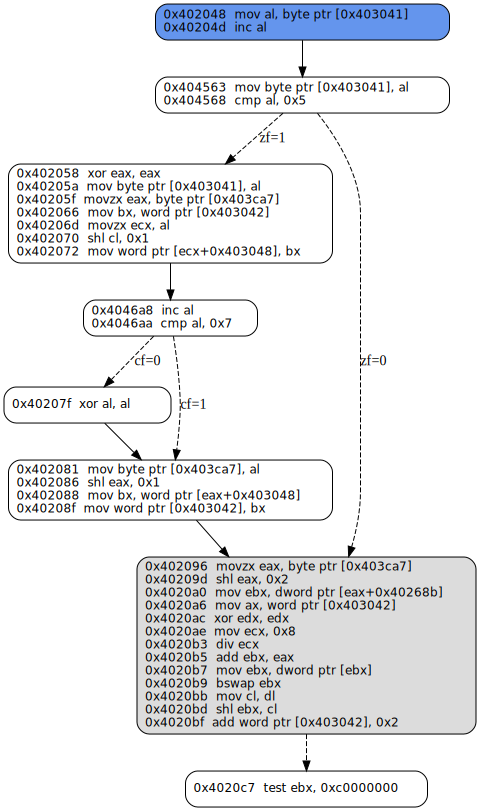

<!-- Title: Unfolding obfuscated code with Reven (part 2) -->
<!-- Date: 2016-12-06 17:25 -->
<!-- Tags: reverse engineering, deobfuscation, ctf -->
<!-- Category: Technical -->
<!-- Author: tdta -->
<!-- Slug: reversing-f4b-challenge-part1 -->

  Last time, we have seen a control flow graph resulted in abstracting the binary from the runtime effect of the first virtual machine. This graph has its unique **entry point** as the basic block starting at `0x402048`, whereas ones at `0x4023d4` and at `0x40266e` are  **exit points** corresponding to the case where the program prints `Yes!` and `Nop!`.

## Loops analysis ##

  It is quite direct to identify **natural loops** [1] in this graph. Indeed, the entry point block is also the root of the *dominator tree*; there are *back-edges*, e.g. from the basic block starting at `0x402460` to the entry point, or from one at `0x402513` to the entry point, etc. These back edges form natural loops which have a common *header* (that is the entry point), then can be combined into a single natural loop. There are also some *nested loops*, e.g. one having the basic block `0x4044d6` as its header and `0x404331 -> 0x4044d6` as its back-edge.

  Since the program terminates by calling `ExitProcess` either at the block `0x4023d4` or `0x40266e` (respectively for `Nop` or `Yes!`), also the exit block (i.e. one at `0x40235`) *post-dominates* these terminating blocks. That means we can "add" two pseudo back-edges `0x4023d4 -> 0x402048` and `0x40266e -> 0x402048` without changing the semantics of the program. Consequently, the program can be interpreted as a single "high-level" `while (true)` loop, with several loops nested within.

  <!-- **Remark:** -->
  <!-- Some properties about the dominance relation between basic blocks can be quickly checked on Reven-Axion. For example, the block `0x403048` is an immediate dominator of `0x404563` then their number of occurrences on the trace must be the same; indeed this number is `178217` for each, this corresponds also to the number of iterations of the outer-most loop. Or the blocks `0x402058` and `0x402096` have the unique post dominator `0x404563` then their sum of occurrences must equal to the number of occurrences of `0x404563`. -->

  The program is "just" a loop, would life be easy from now, huh?. Unfortunately, this time it's not. Welcome to the world of bit-level and multi-process virtual machines.

## Reversing the second virtual machine ##

  We can quickly recognize a "pattern" in the loop. There are "high" blocks, i.e. ones starting at `0x402048`, `0x404563`, `0x402058`, `0x4046a8`, `0x40207f`, `0x402081` and `0x402096`, which seems to be used to extract some value into `ebx`. Next, there are tests on `ebx` with some constants (e.g. at `0x4020d3`, `0x4020c7`, etc.), and depending on the results of tests, there are corresponding "low" blocks, (e.g. at `0x4022f8`, `0x4023de`, `0x40217b`, `0x402486`, .etc) which seems to do the real things.

  This pattern suggests us to think of a **virtual machine** with switch-based dispatcher again: the higher blocks might correspond with the dispatcher whereas the lower ones might correspond with opcodes.

### Dispatcher ###

  Let's consider the higher basic blocks and their control flow, consisting of in the following control flow graph (for comprehension purpose, we omit `nop` instructions in blocks). They form a **region** [1] whose the header is the block at `0x402048`, there is even a unique exit block at `0x402096`: this is indeed an useful property since we can isolate the data-flow analysis for these blocks from other parts of the program.

  

  We first observe that this part of the dispatcher uses values from `5` different memory addresses: `0x403041` (byte access), `0x403ca7` (byte access), `0x403042` (word access), `0x40268b` (double word access).

  **Bit-level access:**
  the block at `0x402096` contains a special pattern which should be focused since it  occurs also at lower basic blocks (e.g. at `0x4023de`, `0x4022f8`, etc). That is the following sequence of instruction:

    mov ebx, dword ptr [eax+0x40268b]  ; ebx = some byte array whose address is stored in [eax+0x40268b]
    mov ax, word ptr [0x403042]        ; eax = a bit-level offset
    xor edx, edx
    mov ecx, 0x8
    div ecx                            ; eax = eax / 8 (byte-level offset)
    add ebx, eax                       ; ebx = the address of byte-offset the array
    mov ebx, dword ptr [ebx]           ; get the dword at this address
    bswap ebx                          ; most sig. byte in ebx becomes the byte at the address, etc
    mov cl, dl                         ; note: edx = eax % 8 (bit-level remainder)
    shl ebx, cl                        ; remove remainder bits
    
  As we have commented above, given some offset `i` in bits, the pattern extracts a `dword` in a byte array from bit-offset `i`, the extracted value is rounded to `2^(i % 8)`.

[1]: Aho, A. V. et al. Compilers: Principles, Techniques, and Tools, 3rd Edition.
